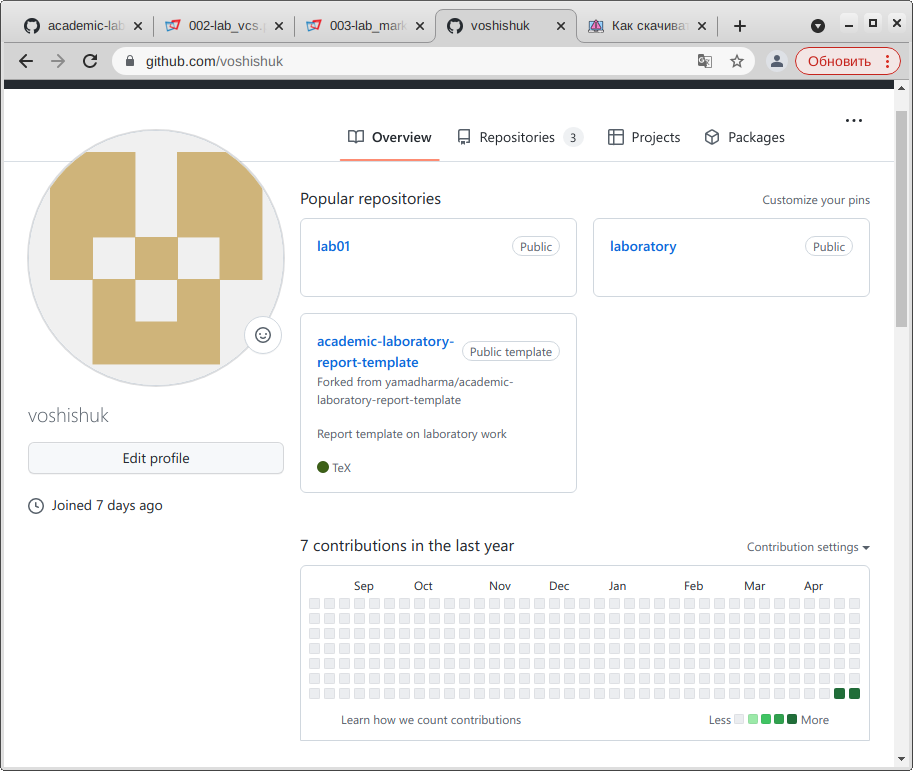
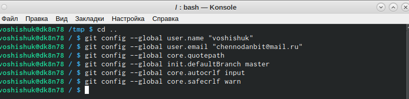
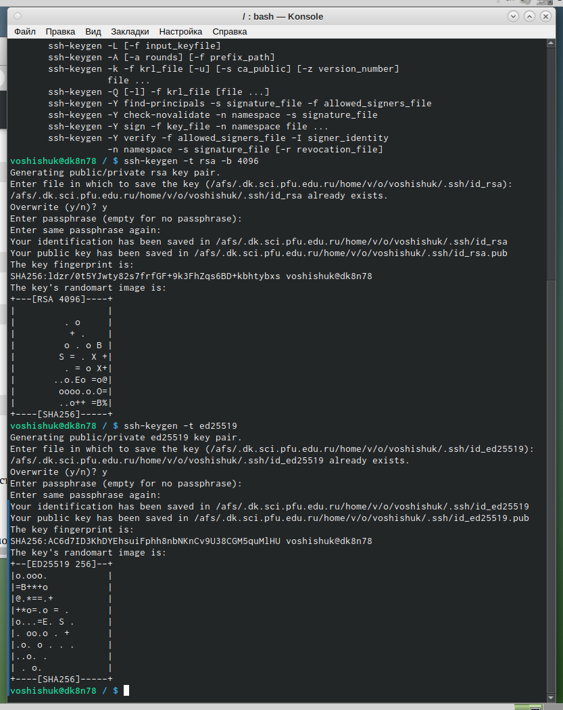
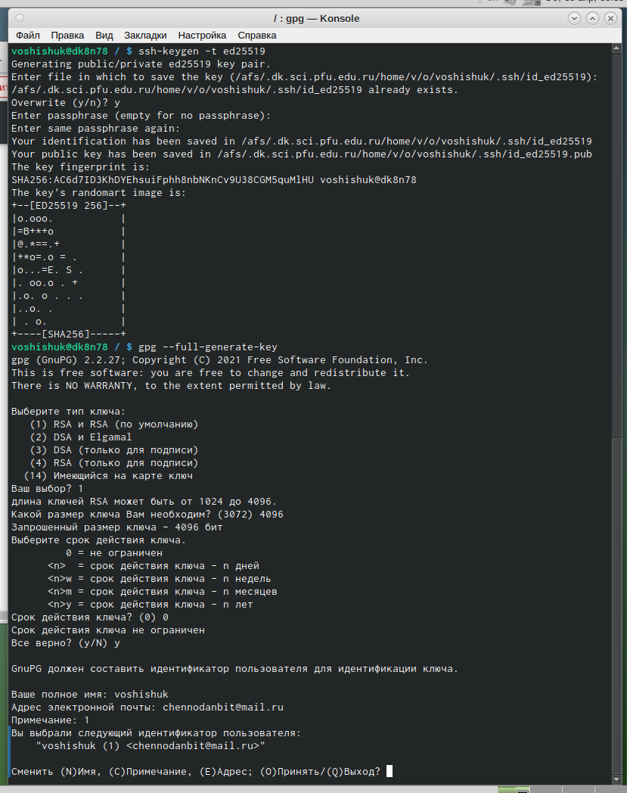
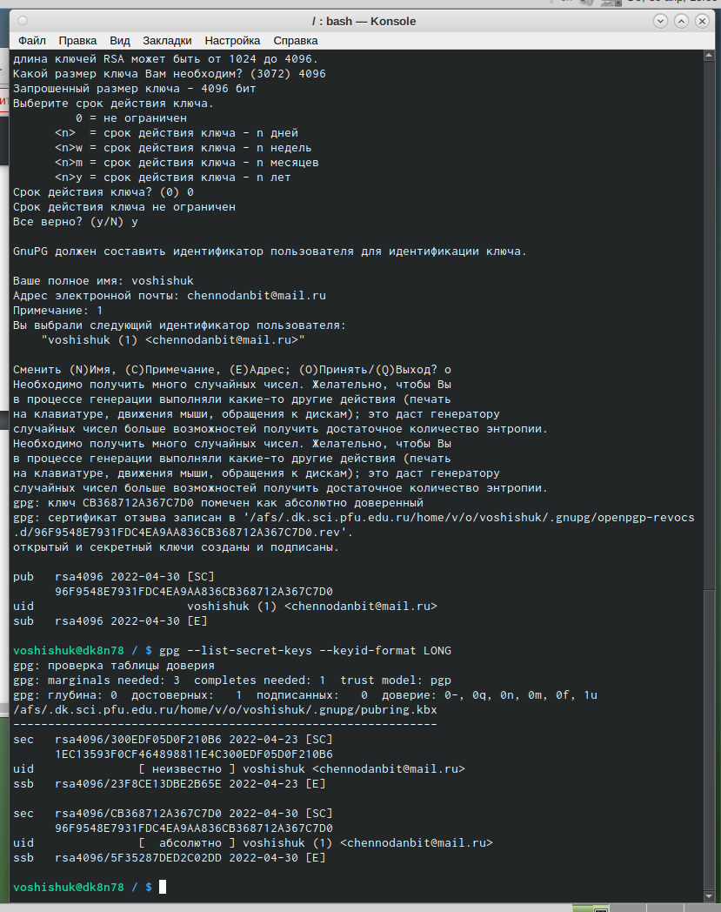
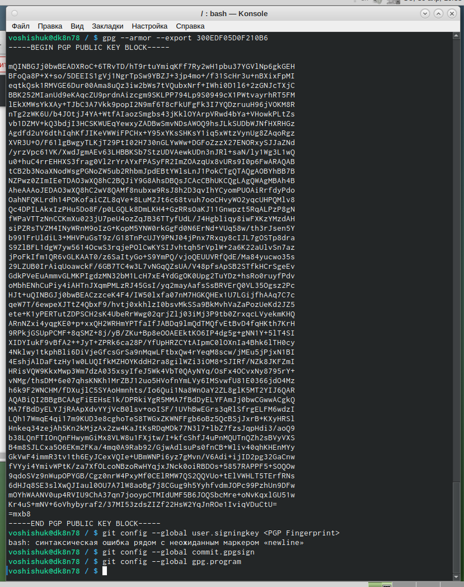
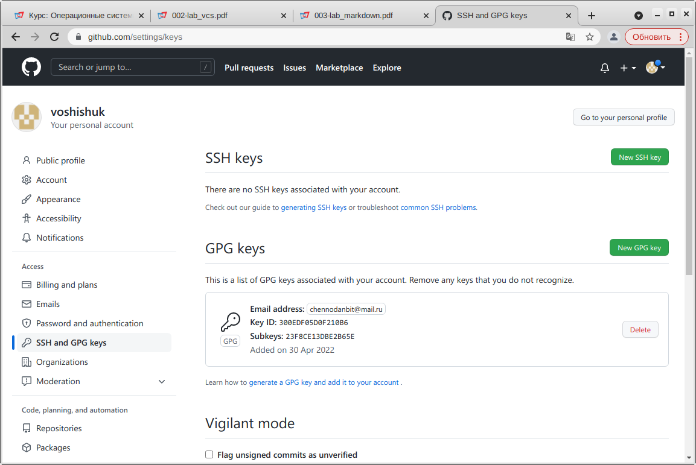
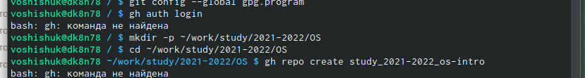

---
## Front matter
title: "Отчет"
subtitle: "по лабораторной работе №2"
author: "Шишук Владислав Олегович, НПМбд-03-21"

## Bibliography
bibliography: bib/cite.bib
csl: pandoc/csl/gost-r-7-0-5-2008-numeric.csl

## Pdf output format
toc: true # Table of contents
toc-depth: 2
lof: true # List of figures
lot: true # List of tables
fontsize: 12pt
linestretch: 1.5
papersize: a4
documentclass: scrreprt
## I18n polyglossia
polyglossia-lang:
  name: russian
  options:
	- spelling=modern
	- babelshorthands=true
polyglossia-otherlangs:
  name: english
## I18n babel
babel-lang: russian
babel-otherlangs: english
## Fonts
mainfont: PT Serif
romanfont: PT Serif
sansfont: PT Sans
monofont: PT Mono
mainfontoptions: Ligatures=TeX
romanfontoptions: Ligatures=TeX
sansfontoptions: Ligatures=TeX,Scale=MatchLowercase
monofontoptions: Scale=MatchLowercase,Scale=0.9
## Biblatex
biblatex: true
biblio-style: "gost-numeric"
biblatexoptions:
  - parentracker=true
  - backend=biber
  - hyperref=auto
  - language=auto
  - autolang=other*
  - citestyle=gost-numeric
## Pandoc-crossref LaTeX customization
figureTitle: "Рис."
tableTitle: "Таблица"
listingTitle: "Листинг"
lofTitle: "Список иллюстраций"
lotTitle: "Список таблиц"
lolTitle: "Листинги"
## Misc options
indent: true
header-includes:
  - \usepackage{indentfirst}
  - \usepackage{float} # keep figures where there are in the text
  - \floatplacement{figure}{H} # keep figures where there are in the text
---

# Цель работы

Изучить идеологию и применение средств контроля версий, освоить умения по работе с git.

# Задание

-Создать базовую конфигурацию для работы с git.  
– Создать ключ SSH.  
– Создать ключ PGP.  
– Настроить подписи git.  
– Зарегистрироваться на Github.  
– Создать локальный каталог для выполнения заданий по предмету.

# Выполнение лабораторной работы

1). Создаем учетную запись на https://github.com . (рисунок 1)

{ #fig:001 width=70% }

2). Задаем имя и email владельца репозитория.Также настраиваем верификацию и подписание коммитов git.(рисунок 2)

{ #fig:002 width=70% }

3). Создаем ключи ssh по алгоритмам rsa и ed25519 (рисунок 3)

{ #fig:003 width=70% }

4). Генерируем ключ pgp.(рисунок 4)

{ #fig:004 width=70% }

5). Выводим список ключей. (рисунок 5)

{ #fig:005 width=70% }

6). Далее выодим pgp ключ с помощью команды gpg --armor --export "отпечаток улюча" (рисунок 6)

{ #fig:006 width=70% }

7). Вводим ключ на GitHub.(рисунок 7)

{ #fig:007 width=70% }

8). К сожалению, при настройке gh терминал писал что, команды gh не найдены.(рисунок 8)

{ #fig:008 width=70% }

   

# Выводы

Освоил некоторые навыки по работе с Git, применил средства контроля версий за время выполнения данной лабороторной работы.

