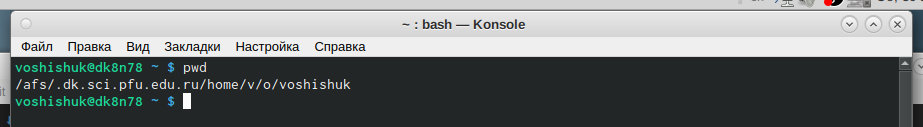

---
## Front matter
title: "Отчет по лабораторной работе №4"
subtitle: "Дисциплина: операционные системы"
author: "Шишук Владислав Олегович, НПМбд-03-21"

## Bibliography
bibliography: bib/cite.bib
csl: pandoc/csl/gost-r-7-0-5-2008-numeric.csl

## Pdf output format
toc: true # Table of contents
toc-depth: 2
lof: true # List of figures
lot: true # List of tables
fontsize: 12pt
linestretch: 1.5
papersize: a4
documentclass: scrreprt
## I18n polyglossia
polyglossia-lang:
  name: russian
  options:
	- spelling=modern
	- babelshorthands=true
polyglossia-otherlangs:
  name: english
## I18n babel
babel-lang: russian
babel-otherlangs: english
## Fonts
mainfont: PT Serif
romanfont: PT Serif
sansfont: PT Sans
monofont: PT Mono
mainfontoptions: Ligatures=TeX
romanfontoptions: Ligatures=TeX
sansfontoptions: Ligatures=TeX,Scale=MatchLowercase
monofontoptions: Scale=MatchLowercase,Scale=0.9
## Biblatex
biblatex: true
biblio-style: "gost-numeric"
biblatexoptions:
  - parentracker=true
  - backend=biber
  - hyperref=auto
  - language=auto
  - autolang=other*
  - citestyle=gost-numeric
## Pandoc-crossref LaTeX customization
figureTitle: "Рис."
tableTitle: "Таблица"
listingTitle: "Листинг"
lofTitle: "Список иллюстраций"
lotTitle: "Список таблиц"
lolTitle: "Листинги"
## Misc options
indent: true
header-includes:
  - \usepackage{indentfirst}
  - \usepackage{float} # keep figures where there are in the text
  - \floatplacement{figure}{H} # keep figures where there are in the text
---

# Цель работы

Приобретение навыков работы с системой посредством командной строки

# Задание

1. Определите полное имя вашего домашнего каталога. Далее относительно этого каталога будут выполняться последующие упражнения.
2. Выполнить следующие действия:
    2.1. Перейти в каталог /tmp.
    2.2. Вывести на экран содержимое каталога /tmp. Для этого использовать команду ls
    с различными опциями. Поясните разницу в выводимой на экран информации.
    2.3. Определите, есть ли в каталоге /var/spool подкаталог с именем cron?
    2.4. Перейтие в Ваш домашний каталог и вывести на экран его содержимое. Определить, кто является владельцем файлов и подкаталогов?
3. Выполните следующие действия:
3.1. В домашнем каталоге создать новый каталог с именем newdir.
3.2. В каталоге ~/newdir создать новый каталог с именем morefun.
3.3. В домашнем каталоге создать одной командой три новых каталога с именами
letters, memos, misk. Затем удалите эти каталоги одной командой.
3.4. Попробовать удалить ранее созданный каталог ~/newdir командой rm. Проверить,
был ли каталог удалён.
3.5. Удалить каталог ~/newdir/morefun из домашнего каталога. Проверьте, был ли
каталог удалён.
4. С помощью команды man определить, какую опцию команды ls нужно использовать для просмотра содержимое не только указанного каталога, но и подкаталогов,
входящих в него.
5. С помощью команды man определить набор опций команды ls, позволяющий отсортировать по времени последнего изменения выводимый список содержимого каталога
с развёрнутым описанием файлов.
6. Использовать команду man для просмотра описания следующих команд: cd, pwd, mkdir,
rmdir, rm. Поясните основные опции этих команд.
7. Используя информацию, полученную при помощи команды history, выполнить модификацию и исполнение нескольких команд из буфера команд.

# Выполнение лабораторной работы

1). С помощью команды pwd определяю полное имя домашнего каталога.(рисунок 1)

 {#fig:001 width=70% }

2).  
2.1 - Перешел в каталог tmp.(рисунок 2).

 {#fig:002 width=70% }

2.2 - вывел на экран содержимое каталога tmp, используя команду ls(рис.2) c различными опциями: "-a" добавляет скрытые файлы,"-F" - типы файлов,"-l" - более подробная информация. (рис.3)

 {#fig:003 width=70% }

2.3 - используя cd и ls, проверяем, есть ли подкаталог cron(рис.4)

 {#fig:004 width=70% }

2.4 - в домашнем каталоге с помощью ls -alF узнаю информацию о владельце каталогов.(рис.5) Владелец - voshishuk.

 {#fig:005 width=70% }

3).  
3.1 - с помощью mkdir создаю каталог newdir.(рис.6)

{ #fig:006 width=70% }

3.2 - в newdir создаю каталог morefun и проверяю его наличие с ls.(рис.6)  
3.3 - с помощью mkdir создаю три каталога, а затем с помощью "rm - r" удаляю их одной командой.(рис.7)

 {#fig:007 width=70% }

3.4 - newdir нельзя удалить командой, это каталог.(рис.8)

 {#fig:008 width=70% }

3.5 - с помощью "rm - r" удалил каталог.(рис.8)  
4). Используя команду «man ls», определяю, какую опцию команды ls
необходимо использовать, чтобы просмотреть содержимое не только
указанного каталога, но и подкаталогов, входящих в него. (рис. 9)

 {#fig:009 width=70% }

6). Используя команды «man cd», «man pwd», «man mkdir», «man rmdir»,
«man rm», просматриваю описание соответствующих команд:(рис.10)

 {#fig:010 width=70% }

Команда pwd  
- -L, --logical
не разыменовывать символические ссылки. Если путь содержит
символические ссылки, то выводить их без преобразования в
исходный путь;  
- --help    
показать справку по команде pwd;  
--version    
показать версию утилиты pwd 

Команда mkdir:  
- -m, --mode=MODE  
устанавливает права доступа для создаваемой директории.
Синтаксис MODE такой же как у команды chmod;
-  -p, --parents  
создать все директории, которые указаны внутри пути. Если
какая-либо директория существует, то предупреждение об этом
не выводится;
- -v, --verbose  
выводить сообщение о каждой создаваемой директории;

Команда rm :
-  -f, --force
игнорировать несуществующие файлы и аргументы. Никогда не
выдавать запросы на подтверждение удаления;
- -i
выводить запрос на подтверждение удаления каждого файла;
- -I
выдать один запрос на подтверждение удаления всех файлов,
если удаляется больше трех файлов или используется
рекурсивное удаление. Опция применяется, как более
«щадящая» версия опции –i;
- -r, -R, --recursive
удаление директорий и их содержимого. Рекурсивное удаление;
- -d, --dir
удалять пустые директории;
- -v, --verbose
выводить информацию об удаляемых файлах;
- --help
показать справку по команде rm;
- --version
показать версию утилиты rm

7). С помощью команды history получил историю моих операций.(рис.11)

 {#fig:011 width=70% }

Контрольный вопросы:  
1. Командная строка – специальная программа, позволяющая управлять
операционной системой при помощи текстовых команд, вводимых в
окне приложения.  
2.  Для определения абсолютного пути к текущему каталогу используется
команда pwd (print working directory).
3. Команда «ls -F» (или «ls -aF», тогда появятся еще скрытые файлы)
выведет имена файлов в текущем каталоге и их типы.
Тип каталога обозначается /, тип исполняемого файла обозначается *,
тип ссылки обозначается @.
4. Имена скрытых файлов начинаются с точки. Эти файлы в
операционной системе скрыты от просмотра и обычно используются
для настройки рабочей среды. Для того, чтобы отобразить имена
скрытых файлов, необходимо использовать команду «ls –a».
5. Команда rm используется для удаления файлов и/или каталогов.
Команда rm -i выдает запрос подтверждения на удаление файла.
Команда rm -r необходима, чтобы удалить каталог, содержащий файлы.
Без указания этой опции команда не будет выполняться. Если каталог
пуст, то можно воспользоваться командой rmdir. Если удаляемый
каталог содержит файлы, то команда не будет выполнена – нужно
использовать «rm -r имя_каталога».
Таким образом, каталог, не содержащий файлов, можно удалить и
командой rm, и командой rmdir. Файл командой rmdir удалить нельзя.
6. Чтобы определить, какие команды выполнил пользователь в сеансе
работы, необходимо воспользоваться командой «history».
7. Чтобы исправить или запустить на выполнение команду, которую
пользователь уже использовал в сеансе работы, необходимо: в первом
случае: воспользоваться конструкциеq
!номер команды:s/что_меняем/на_что_меняем, во втором
случае: !номер_команды.
8. Чтобы записать в одной строке несколько команд, необходимо между
ними поставить ; . Например, «cd /tmp; ls».
9. Символ обратного слэша \ позволяет использовать управляющие
символы ( ".", "/", "$", "*", "[", "]", "^", "&") без их интерпретации
командной оболочкой; процедура добавления данного символа перед
управляющими символами называется экранированием символов.
10. Команда «ls -l» отображает список каталогов и файлов с подробной
информацией о них (тип файла, право доступа, число ссылок,
владелец, размер, дата последней ревизии, имя файла или каталога).
11. Полный, абсолютный путь от корня файловой системы – этот путь
начинается от корня "/" и описывает весь путь к файлу или каталогу;
Относительный путь – это путь к файлу относительно текущего
каталога (каталога, где находится пользователь).
12. Чтобы получить необходимую информацию о команде, необходимо
воспользоваться конструкцией man (имя_команды), либо использовать
опцию help, которая предусмотрена для некоторых команд.
13. Для автоматического дополнения вводимых команд служит клавиша
Tab.
    

# Выводы

Во время выполнения данной лабораторной работы я приобрел практические навыки работы с системой посредством командной строки.
