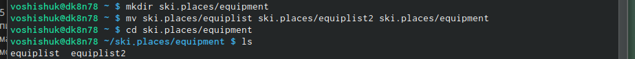

---
## Front matter
title: "Отчет по лабораторной работе №5"
subtitle: "Дисциплина: операционные системы"
author: "Шишук Владислав Олегович, НПМбд-03-21"

## Bibliography
bibliography: bib/cite.bib
csl: pandoc/csl/gost-r-7-0-5-2008-numeric.csl

## Pdf output format
toc: true # Table of contents
toc-depth: 2
lof: true # List of figures
lot: true # List of tables
fontsize: 12pt
linestretch: 1.5
papersize: a4
documentclass: scrreprt
## I18n polyglossia
polyglossia-lang:
  name: russian
  options:
	- spelling=modern
	- babelshorthands=true
polyglossia-otherlangs:
  name: english
## I18n babel
babel-lang: russian
babel-otherlangs: english
## Fonts
mainfont: PT Serif
romanfont: PT Serif
sansfont: PT Sans
monofont: PT Mono
mainfontoptions: Ligatures=TeX
romanfontoptions: Ligatures=TeX
sansfontoptions: Ligatures=TeX,Scale=MatchLowercase
monofontoptions: Scale=MatchLowercase,Scale=0.9
## Biblatex
biblatex: true
biblio-style: "gost-numeric"
biblatexoptions:
  - parentracker=true
  - backend=biber
  - hyperref=auto
  - language=auto
  - autolang=other*
  - citestyle=gost-numeric
## Pandoc-crossref LaTeX customization
figureTitle: "Рис."
tableTitle: "Таблица"
listingTitle: "Листинг"
lofTitle: "Список иллюстраций"
lotTitle: "Список таблиц"
lolTitle: "Листинги"
## Misc options
indent: true
header-includes:
  - \usepackage{indentfirst}
  - \usepackage{float} # keep figures where there are in the text
  - \floatplacement{figure}{H} # keep figures where there are in the text
---

# Цель работы

Ознакомление с файловой системой Linux и её структурой, а также именами и содержанием каталогов. Приобретение практических навыков п применению команд для работы с файлами и каталогами.

# Ход выполнения лабораторной работы

1). -  
2).  
2.1 - Копируем файл /usr/include/sys/dir.h командой cp в домашний каталог и называем его
equipment(mv dir.h equipment).(рис.1)

 {#fig:001 width=70% }

2.2 - В домашнем каталоге создаем директорию ю ~/ski.plases командой mkdir(рис.2)

2.3 - Переместили каталог equipment в каталог  ~/ski.plases с помощью mv(рис.2)

 {#fig:002 width=70% }

2.4 - Переименовываем файл ~/ski.plases/equipment в ~/ski.plases/equiplist с помощью mv(рис.3)

2.5 - Создаем с помощью touch файл acb1 и копируем его в ~/ski.plases благодаря команде cp, называем его equiplist2 с помощью mv.(рис.3)

 {#fig:003 width=70% }

2.6 - Создаём каталог с именем equipment в каталоге ~/ski.plases с помощью mkdir(рис.4)

2.7 - Перемещаем файлы ~/ski.plases/equiplist и equiplist2 в каталог
~/ski.plases/equipment с помощью команды mv.(рис.4)

 {#fig:004 width=70% }

2.8 - Создаем(mkdir) и перемещаем(mv) каталог ~/newdir в каталог ~/ski.plases, называем(mv)
его plans.(рис.5)

 {#fig:005 width=70% }

3). Определяем опции команды chmod, необходимые для того, чтобы присвоить перечисленным ниже файлам выделенные права доступа, считая, что в начале таких прав
нет. Сначала создаем данные файлы.(рис.6)

 {#fig:006 width=70% }

3.1 - drwxr–r– … australia: команда «chmod 744 australia» (это каталог, владелец имеет право на чтение, запись и выполнение, группа владельца и остальные – только чтение).  
3.2 - drwx–x–x … play: команда «chmod 711 play» (это каталог, владелец имеет право на чтение, запись и выполнение, группа владельца и остальные – только выполнение).  
3.3 --r-xr–r– … my_os: команды «chmod 544 my_os» (это файл, владелец имеет право на чтение и выполнение, группа владельца и остальные – только чтение).  
3.4 - -rw-rw-r– … feathers: команды «chmod 664 feathers» (это файл,владелец и группа владельца имеют право на чтение и запись,остальные – только чтение). Командой «ls -l» проверяем правильность выполненных действий.  

4). Проделываем упражнения (рис.7):  
4.1 - Просмотрим содержимое файла /etc/passwd (команда «cat /etc/passwd»).  
4.2 - Копируем файл ~/feathers в файл ~/file.old (команда «cp feathers file.old»).  
4.3 - Переместим файл ~/file.old в каталог ~/play (команда «mv file.ord play»).  
4.4 - Скопируем каталог ~/play в каталог ~/fun (команда «cp -r play fun»).  
4.5 - Переместим каталог ~/fun в каталог ~/play (команда «mv fun play») и назовем его games (команда «mv play/fun play/games»).  
4.6 - Лишим владельца файла ~/feathers права на чтение (команда «chmodu-r feathers»).  
4.7 - Если мы попытаемся просмотреть файл ~/feathers командой cat, то получим отказ в доступе, т.к. в предыдущем пункте лишили владельца права на чтение данного файла.  
4.8 - Если мы попытаемся скопировать файл ~/feathers, например, в каталог monthly, то получим отказ в доступе, по причине,описанной в пункте 7.  
4.9 - Дадим владельцу файла ~/feathers право на чтение (команда «chmod u+r feathers»).  
4.10 - Лишим владельца каталога ~/play права на выполнение (команда «chmod u-x play»).  
4.11 - Перейдем в каталог ~/play (команда «cd play»). Получим отказ в доступе, т.к. в предыдущем пункте лишили владельца права на выполнение данного каталога.  
4.12 -  Дадим владельцу каталога ~/play право на выполнение (команда «chmod u+x play»).  

 {#fig:007 width=70% }

5).  Используя команды «man mount», «man fsck», «man mkfs», «man kill», получим информацию о соответствующих командах.(рис.8)

 {#fig:008 width=70% }

1. Команда mount: предназначена для монтирования файловой системы. Все файлы, доступные в Unix системах, составляют иерархическую файловую структуру, которая имеет ветки (каталоги) и листья (файлы в каталогах).
Корень этого дерева обозначается как /. Физически файлы могут располагаться на различных устройствах.
Команда mount служит для подключения файловых систем разных устройств к этому большому дереву. Наиболее часто встречающаяся форма команды mount выглядит следующим образом: «mount -t vfstype device dir». Такая команда предлагает ядру смонтировать (подключить) файловую систему указанного типа vfstype, расположенную на устройстве device, к заданному каталогу dir, который часто называют точкой монтирования.
2. Команда fsck: это утилита командной строки, которая позволяет выполнять проверки согласованности и интерактивное исправление в одной или нескольких файловых системах Linux. Он использует программы, специфичные для типа файловой системы, которую он проверяет.
У команды fsck следующий синтаксис: fsck [параметр] – [параметры ФС] [ . . .] Например, если нужно восстановить («починить») файловую систему на некотором устройстве /dev/sdb2, следует воспользоваться командой: «sudo fsck -y /dev/sdb2».
Опция -y необходима, т. к. при её отсутствии придётся слишком часто давать подтверждение.
3. Команда mkfs: создаёт новую файловую систему Linux. Имеет следующий синтаксис: mkfs [ V ] [ -t fstype ] [ fs-options ] filesys [ blocks ] mkfs используется для создания файловой системы Linux на некотором устройстве, обычно в разделе жёсткого диска. В качестве аргумента filesys для файловой системы может выступать или название устройства (например, /dev/hda1, /dev/sdb2) или точка монтирования (например, /, usr, /home).
Аргументом blocks указывается количество блоков, которые выделяются для использования этой файловой системой.
По окончании работы mkfs возвращает 0 - в случае успеха, а 1 - при неудачной операции. Например, команда «mkfs -t ext2 /dev/hdb1» создаёт файловую систему типа ext2 в разделе /dev/hdb1 (второй жёсткий диск).
4. Команда kill: посылает сигнал процессу или выводит список допустимых сигналов. Имеет следующий синтаксис: kill [опции] PID, где PID – это PID (числовой идентификатор) процесса или несколько PID процессов, если требуется послать сигнал сразу нескольким процессам.
Например, команда «kill -KILL 3121» посылает сигнал KILL процессу с PID 3121, чтобы принудительно завершить процесс.

## Контрольные вопросы:
1. Чтобы узнать, какие файловые системы существуют на жёстком диске моего компьютера, использую команду «df -Th». После выполнения команды видно, что на моем компьютере есть следующие файловые системы: devtmpfs, tmpfs, ext4, iso9660. devtmpfs позволяет ядру создать экземпляр tmpfs с именем devtmpfs при инициализации ядра, прежде чем регистрируется какое-либо устройство с драйверами. Каждое устройство с майором / минором будет предоставлять узел устройства в devtmpfs. devtmpfs монтируется на /dev и содержит специальные файлы устройств для всех устройств. tmpfs − временное файловое хранилище во многих Unix-подобных ОС. Предназначена для монтирования файловой системы, но размещается в ОЗУ вместо ПЗУ. Подобная конструкция является RAM диском. Данная файловая система также предназначенная для быстрого и ненадёжного хранения временных данных. Хорошо подходит для /tmp и массовой сборки пакетов/образов. Предполагает наличие достаточного объёма виртуальной памяти. Файловая система tmpfs предназначена для того, чтобы использоватьчасть физической памяти сервера как обычный дисковый раздел, в котором можно сохранять данные (чтение и запись). Поскольку данные размещены в памяти, то чтение или запись происходят во много раз быстрее, чем с обычного HDD диска. ext4 − имеет обратную совместимость с предыдущими версиями ФС. Эта версия была выпущена в 2008 году. Является первой ФС из «семейства» Ext, использующая механизм «extent file system», который позволяет добиться меньшей фрагментации файлов и увеличить общую производительность файловой системы. Кроме того,в Ext4 реализован механизм отложенной записи (delayed allocation − delalloc), который так же уменьшает фрагментацию диска и снижает нагрузку на CPU. С другой стороны, хотя механизм отложенной записи и используется во многих ФС, но в силу сложности своей реализации он повышает вероятность утери данных. Характеристики: -максимальный размер файла: 16 TB; -максимальный размер раздела: 16 TB; -максимальный размер имени файла: 255 символов. Рекомендации по использованию: -наилучший выбор для SSD; -наилучшая производительность по сравнению с предыдущими Etx-системами; -она так же отлично подходит в качестве файловой системы для серверов баз данных, хотя сама система и моложе Ext3. ISO 9660 − стандарт, выпущенный Международной организацией по стандартизации, описывающий файловую систему для дисков CD-ROM. Также известен как CDFS (Compact Disc File System). Целью стандарта является обеспечить совместимость носителей под разными операционными системами, такими, как Unix, Mac OS, Windows.
2. -
3. Чтобы содержимое некоторой файловой системы было доступно операционной системе необходимо воспользоваться командой mount.
4. Целостность файловой системы может быть нарушена из-за перебоев в питании, неполадок в оборудовании или из-за некорректного/внезапного выключения компьютера. Чтобы устранить повреждения файловой системы необходимо использовать команду fsck.
5. Файловую систему можно создать, используя команду mkfs.
6. -
7. Утилита cp позволяет полностью копировать файлы и директории. Cинтаксис: cp [опции] файл-источник файл-приемник После выполнения команды файл-источник будет полностью перенесен в файл-приемник. Если в конце указан слэш, файл будет записан в заданную директорию с оригинальным именем. Основные опции: –attributes-only − не копировать содержимое файла, а только флаги доступа и владельца -f, –force − перезаписывать существующие файлы -i, –interactive − спрашивать, нужно ли перезаписывать существующие файлы -L − копировать не символические ссылки, а то, на что они указывают -n − не перезаписывать существующие файлы -P − не следовать символическим ссылкам -r − копировать папку Linux рекурсивно -s − не выполнять копирование файлов в Linux, а создавать символические ссылки -u − скопировать файл, только если он был изменён -x − не выходить за пределы этой файловой системы -p − сохранять владельца, временные метки и флаги доступа при копировании -t − считать файл-приемник директорией и копировать файл-источник в эту директорию.
8. Команда mv используется для перемещения одного или нескольких файлов (или директорий) в другую директорию, а также для переименования файлов и директорий. Синтаксис: mv [-опции] старый_файл новый_файл Основные опции: –help − выводит на экран официальную документацию об утилите –version − отображает версию mv -b − создает копию файлов, которые были перемещены или перезаписаны -f − при активации не будет спрашивать разрешение у владельца файла, если речь идет о перемещении или переименовании файла -i − наоборот, будет спрашивать разрешение у владельца -n − отключает перезапись уже существующих объектов –strip-trailing-slashes — удаляет завершающий символ / у файла при его наличии -t [директория] — перемещает все файлы в указанную директорию -u − осуществляет перемещение только в том случае, если исходный файл новее объекта назначения -v − отображает сведения о каждом элементе во время обработки команды Команда rename также предназначена, чтобы переименовать файл. Синтаксис: rename [опции] старое_имя новое_имя файлы Основные опции: -v − вывести список обработанных файлов -n − тестовый режим, на самом деле никакие действия выполнены не будут -f − принудительно перезаписывать существующие файлы.
9. -

# Выводы

За время выполнения данной лабораторной работы я ознакомился со структурой файловой системы Linux, а также приобрел навыки применения команд для работы с файлами и каталогами.