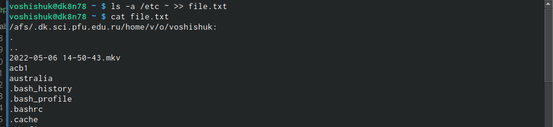
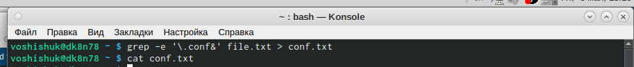
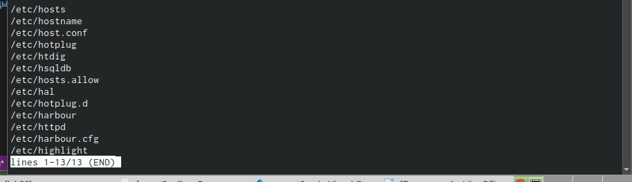
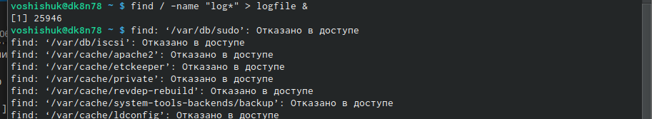
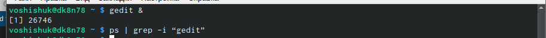
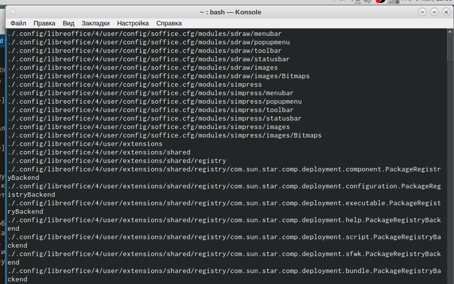

---
## Front matter
title: "Шаблон отчёта по лабораторной работе №6"
subtitle: "Дисциплина: Операционные Системы"
author: "Шишук Владислав Олегович, НПМбд-03-21"

## Generic otions
lang: ru-RU
toc-title: "Содержание"

## Bibliography
bibliography: bib/cite.bib
csl: pandoc/csl/gost-r-7-0-5-2008-numeric.csl

## Pdf output format
toc: true # Table of contents
toc-depth: 2
lof: true # List of figures
lot: true # List of tables
fontsize: 12pt
linestretch: 1.5
papersize: a4
documentclass: scrreprt
## I18n polyglossia
polyglossia-lang:
  name: russian
  options:
	- spelling=modern
	- babelshorthands=true
polyglossia-otherlangs:
  name: english
## I18n babel
babel-lang: russian
babel-otherlangs: english
## Fonts
mainfont: PT Serif
romanfont: PT Serif
sansfont: PT Sans
monofont: PT Mono
mainfontoptions: Ligatures=TeX
romanfontoptions: Ligatures=TeX
sansfontoptions: Ligatures=TeX,Scale=MatchLowercase
monofontoptions: Scale=MatchLowercase,Scale=0.9
## Biblatex
biblatex: true
biblio-style: "gost-numeric"
biblatexoptions:
  - parentracker=true
  - backend=biber
  - hyperref=auto
  - language=auto
  - autolang=other*
  - citestyle=gost-numeric
## Pandoc-crossref LaTeX customization
figureTitle: "Рис."
tableTitle: "Таблица"
listingTitle: "Листинг"
lofTitle: "Список иллюстраций"
lotTitle: "Список таблиц"
lolTitle: "Листинги"
## Misc options
indent: true
header-includes:
  - \usepackage{indentfirst}
  - \usepackage{float} # keep figures where there are in the text
  - \floatplacement{figure}{H} # keep figures where there are in the text
---

# Цель работы

Ознакомление с инструментами поиска файлов и фильтрации текстовых данных. Приобретение практических навыков: управления процессами, проверки использования диска и обслуживания файловых систем.

# Выполнение лабораторной работы
1). Осуществляем вход в систему, используя свои логин и пароль.  
2). Записываем в файл file.txt названия файлов, содержащихся в каталоге /etc c помощью команды ls -s ~ >> file.txt(рис. 1)

 {#fig:001 width=70% }

3). Выводим имена всех файлов file.txt, имеющих расширение .conf с помощью  grep -e... и записываем в файл conf.txt(рис.2)

 {#fig:002 width=70% }

4). Определяем, какие файлы начинаются с символа "с" в моем домашнем каталоге с помощью команды "ls ~/c*"(рис.3)

 {#fig:003 width=70% }

5). Используем команду "find /etc -maxdepth 1 -name "h*"| less ", чтобы вывести на экран файлы из /etc, начинающиеся с "h" (рис.4.1,рис.4.2)

 {#fig:004 width=70% }

 {#fig:005 width=70% }

6). Запусукаем в фоновом режиме процесс, который будет записывать в ~/logfile
файлы, имена которых начинаются с log с помощью команды "find / -name "log*" > logfile &".(рис.5)

 {#fig:006 width=70% }

7). Удаляем(rm) файл  ~/logfile (рис.6)

 {#fig:007 width=70% }

8). Запускаем редактор gedit в фоновом режиме командой «gedit &», на экране появляется окно редактора. (рич.7)

9). Чтобы определить идентификатор процесса gedit, используем команду «ps | grep -i “gedit”». Процесс имеет PID 26746. Узнать идентификатор процесса можно также, используя команду «pgrep gedit» или «pidof gedit». (рис.7)

 {#fig:008 width=70% }

10).Прочитав информацию о команде kill с помощью команды «man kill», используем её для завершения процесса gedit (команда «kill 26746»). (рис. 8)

 {#fig:009 width=70% }

12). Воспользовавшись справкой команды find (man find), вывел имена всех директорий в домашнем каталоге(find -type d). (рис.9) 

 {#fig:010 width=70% }

# Выводы

В ходе данной лабораторной работы я изучил инструменты поиска файлов и фильтрации текстовых данных. Также приобрел практические навыки: по управлению процессами, по проверке использования диска и обслуживания файловых систем