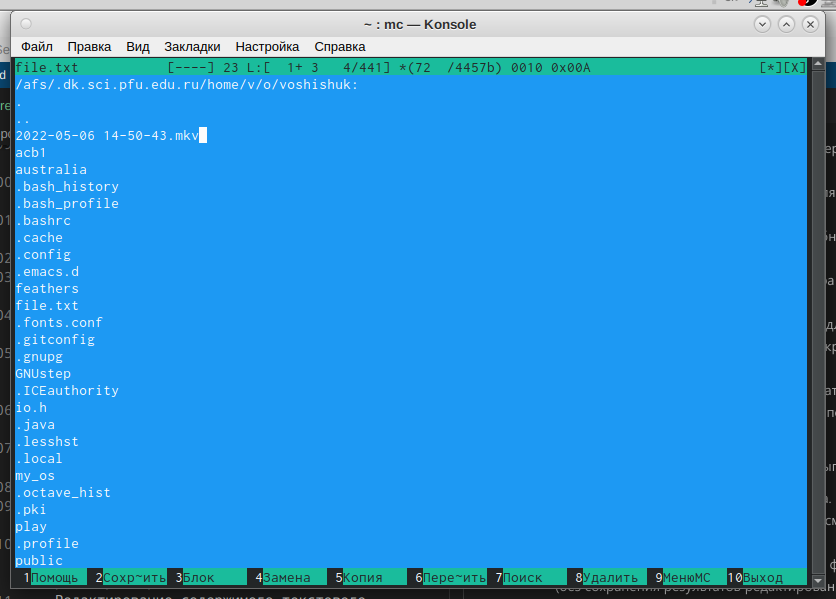

---
## Front matter
title: "Отчёт по лабораторной работе №7"
subtitle: "Дисциплина: Операционные Системы"
author: "Шишук Владислав Олегович, НПМбд-03-21"

## Generic otions
lang: ru-RU
toc-title: "Содержание"

## Bibliography
bibliography: bib/cite.bib
csl: pandoc/csl/gost-r-7-0-5-2008-numeric.csl

## Pdf output format
toc: true # Table of contents
toc-depth: 2
lof: true # List of figures
lot: true # List of tables
fontsize: 12pt
linestretch: 1.5
papersize: a4
documentclass: scrreprt
## I18n polyglossia
polyglossia-lang:
  name: russian
  options:
	- spelling=modern
	- babelshorthands=true
polyglossia-otherlangs:
  name: english
## I18n babel
babel-lang: russian
babel-otherlangs: english
## Fonts
mainfont: PT Serif
romanfont: PT Serif
sansfont: PT Sans
monofont: PT Mono
mainfontoptions: Ligatures=TeX
romanfontoptions: Ligatures=TeX
sansfontoptions: Ligatures=TeX,Scale=MatchLowercase
monofontoptions: Scale=MatchLowercase,Scale=0.9
## Biblatex
biblatex: true
biblio-style: "gost-numeric"
biblatexoptions:
  - parentracker=true
  - backend=biber
  - hyperref=auto
  - language=auto
  - autolang=other*
  - citestyle=gost-numeric
## Pandoc-crossref LaTeX customization
figureTitle: "Рис."
tableTitle: "Таблица"
listingTitle: "Листинг"
lofTitle: "Список иллюстраций"
lotTitle: "Список таблиц"
lolTitle: "Листинги"
## Misc options
indent: true
header-includes:
  - \usepackage{indentfirst}
  - \usepackage{float} # keep figures where there are in the text
  - \floatplacement{figure}{H} # keep figures where there are in the text
---

# Цель работы

Освоение основных возможностей командной оболочки Midnight Commander, а также риобретение навыков практической работы по просмотру каталогов и файлов; манипуляций
с ними.

# Выполнение лабораторной работы
1). С помощью команды man, изучаем информацию об mc. (рис.1)

{#fig:001 width=70% }

2) Запустим из командной строки mc, изучим его структуру и меню. (рис.2)

{#fig:002 width=70% }
- В стандартном состоянии окно редактора состоит из двух панелей.
- верзхнее меню содержит подменю "Левая панель","Файл","Команда","Настройки","Правая панель".
- "fn" + "F1" открывает ""(рис.3)

{#fig:003 width=70% }
- "fn" + "F2" открывает меню пользователя(рис.4) 
{#fig:004 width=70% }

3). Выполним несколько операций в mc, используя управляющие клавиши:
- Операции с панелями. Меняем панели местами с помощью клавиш "ctrl" + "u". Изменяем режим панелей на "дерево"(рис.5) и "информация".(рис.6)

{#fig:005 width=70% }

{#fig:006 width=70% }

- Выделение/отмена выделения файлов. Используем пункты в "отметить группу", "снять отметку", "Обратить выделение" в меню "Файл". (рис.7)

{#fig:007 width=70% }

- Копирование/перемещение. Для копирования файлов используем клавиши "fn" + "F5"(рис.8). Для перемещения "fn" + "F6"(рис.9).

{#fig:008 width=70% }

{#fig:009 width=70% }

-  Получение информации о размере и правах доступа на файлы и/или каталоги. Для получения данной информации нужно перейти в пункты: "Левая панель" - "Информация", "Левая панель" - "формат списка" - "Расширенный","Файл" - "Права доступа", "Файл" - "права(расширенные)". (рис.10 - рис.12)

{#fig:010 width=70% }

{#fig:011 width=70% }

{#fig:012 width=70% }

4). Выполним основные команды меню левой панели.
- Пункт «Список файлов» отображает размер файла и время его правки.
- Пункт «Быстрый просмотр» необходим для предпросмотра содержания
файла. 
- Пункт «Информация» отображает подробные данные о файле.
- Пункт «Дерево» необходим для просмотра дерева каталога. 
- Пункт «Порядок сортировки» необходим для сортировки файлов или каталогов по конкретному критерию.
- Пункт «Фильтр» необходим, чтобы просматривать название файлов или
каталогов, которые подходят под указанную маску.   

5). Используя возможности подменю «Файл», выполним:
- Просмотр содержимого текстового файла. Выберем текстовый файл и перейдем в пункт «Просмотр». (рис.13)

{#fig:013 width=70% }

- Редактирование содержимого текстового файла (без сохранения результатов редактирования). Перейдем в пункт «Правка» и изменим текст.(рис.14)

{#fig:014 width=70% }

- Создание каталога. Перейдем в пункт «Создание каталога» и создадим
каталог 123.(рис.15)

{#fig:015 width=70% }

- Копируем файл в созданный каталог.(рис.16)

{#fig:016 width=70% }

6). С помощью подменю Команда:
- Поиск в файловой системе файла с заданными условиями. Перейдем в пункт
«Поиск файла» и зададим следующие параметры: «От каталога» /, «Шаблон
имени» *.сpp, «Содержимое» main, выполним поиск.(рис.17)

{#fig:017 width=70% }

- Выбор и повторение одной из предыдущих команд.Перейдем в пункт «История командной строки» и увидим, что внизу экрана появилась сноска
«История», выполним одну из предыдущих команд.(рис.18)

{#fig:018 width=70% }

- Переход в домашний каталог. Для перехода в домашний каталог перейдем в
пункт «Дерево каталогов», выберем необходимый каталог и нажмем «enter»,
в результате чего, в перейдем в домашний каталог. (рис.19)

{#fig:019 width=70% }

- Анализ файла меню и файла расширений. Перейдем в пункт «Редактировать файл расширений». “Редактировать файл расширений” − позволяет
задать с помощью определённого синтаксиса действия при запуске файлов
с определённым расширением. (рис.20)

{#fig:020 width=70% }

# Выводы

За время выполнения данной лабораторной работы я освоил навыки работы с Midnight Commander
и приобрела навыки практической работы по просмотру каталогов и файлов.
# Контрольные вопросы
1. 
2. Как с помощью команд shell, так и с помощью меню (комбинаций клавиш)
mc можно выполнить следующие операции с файлами:
- копирование «F5» («cp имя_файла имя_каталога(в который копируем)»)
- перемещение/переименование «F6» («mv имя_файла имя_каталога(в который перемещаем)»)
- создание каталога «F7» («mkdir имя_каталога»)
- удаление «F8» («rm имя_файла»)
- изменение прав доступа «ctrl+x» («chmod u+x имя_файла»)
3. Перейти в строку меню панелей mc можно с помощью функциональной
клавиши «F9». В строке меню имеются пять меню: «Левая панель», «Файл»,
«Команда», «Настройки» и «Правая панель». Подпункт меню «Быстрый просмотр» позволяет выполнить быстрый просмотр содержимого панели. Подпункт меню «Информация» позволяет посмотреть информацию о файле
или каталоге. В меню каждой (левой или правой) панели можно выбрать
«Формат списка»:
- стандартный − выводит список файлов и каталогов с указанием размера и
времени правки;
- ускоренный − позволяет задать число столбцов, на которые разбивается
панель при выводе списка имён файлов или каталогов без дополнительной
информации;
- расширенный − помимо названия файла или каталога выводит сведения о
правах доступа, владельце, группе, размере, времени правки;
4. Команды меню «Файл»:
- Просмотр («F3») − позволяет посмотреть содержимое текущего (или выделенного) файла без возможности редактирования.
- Просмотр вывода команды («М» + «!») − функция запроса команды с параметрами (аргумент к текущему выбранному файлу).
- Правка («F4») − открывает текущий (или выделенный) файл для его редактирования.
- Копирование («F5») − осуществляет копирование одного или нескольких
файлов или каталогов в указанное пользователем во всплывающем окне
место.
- Права доступа («Ctrl-x» «c») − позволяет указать (изменить) права доступа к
одному или нескольким файлам или каталогам.
- Жёсткая ссылка («Ctrl-x» «l») − позволяет создать жёсткую ссылку к текущему
(или выделенному) файлу.
- Символическая ссылка («Ctrl-x» «s») − позволяет создать cимволическую
ссылку к текущему (или выделенному) файлу
5. Меню Команда В меню Команда содержатся более общие команды для
работы с mc. Команды меню Команда:
- Дерево каталогов − отображает структуру каталогов системы.
- Поиск файла − выполняет поиск файлов по заданным параметрам.
- Переставить панели − меняет местами левую и правую панели.
- Сравнить каталоги («Ctrl-x» «d») − сравнивает содержимое двух каталогов.
- Размеры каталогов − отображает размер и время изменения каталога (по
умолчанию в mc размер каталога корректно не отображается).
- История командной строки − выводит на экран список ранее выполненных
в оболочке команд.
- Каталоги быстрого доступа ( Ctrl-») − при вызове выполняется быстрая
смена текущего каталога на один из заданного списка.
- Восстановление файлов − позволяет восстановить файлы на файловых системах ext2 и ext3.
- Редактировать файл расширений − позволяет задать с помощью определённого синтаксиса действия при запуске файлов с определённым расширением (например, какое программного обеспечение запускать для открытия
или редактирования файлов с расширением doc или docx).
6. Меню Настройки содержит ряд дополнительных опций по внешнему виду
и функциональности mc. Меню Настройки содержит:
- Конфигурация − позволяет скорректировать настройки работы с панелями.
- Внешний вид и Настройки панелей − определяет элементы(строка меню,
командная строка, подсказки и прочее), отображаемые при вызове mc, а
также геометрию расположения панелей и цветовыделение.
- Биты символов − задаёт формат обработки информации локальным терминалом.
- Подтверждение − позволяет установить или убрать вывод окна с запросом
подтверждения действий при операциях удаления и перезаписи файлов, а
также при выходе из программы.
- Распознание клавиш − диалоговое окно используется для тестирования
функциональных клавиш, клавиш управления курсором и прочее.
- Виртуальные ФС − настройки виртуальной файловой системы: тайм-аут,
пароль и прочее.
7. Функциональные клавиши mc:
- F1 – вызов контекстно-зависимой подсказки
- F2 – вызов пользовательского меню с возможностью создания и/или дополнения дополнительных функций
- F3 – просмотр содержимого файла, на который указывает подсветка в активной панели (без возможности редактирования)
- F4 – вызов встроенного в mc редактора для изменения содержания файла,
на который указывает подсветка в активной панели
- F5 – копирование одного или нескольких файлов, отмеченныхв первой
(активной) панели, в каталог, отображаемый на второй панели
- F6 – перенос одного или нескольких файлов, отмеченных в первой (активной) панели, в каталог, отображаемый на второй панели
- F7 – создание подкаталога в каталоге, отображаемом в активной панели
- F8 – удаление одного или нескольких файлов (каталогов), отмеченных в
первой (активной) панели файлов
- F9 – вызов меню mc
- F10 – выход из mc
8. Встроенный в mc редактор вызывается с помощью функциональной клавиши «F4». В нём удобно использовать различные комбинации клавиш при
редактировании содержимого (как правило текстового) файла. Клавиши
для редактирования файла:
- «Ctrl-y» − удалить строку
- «Ctrl-u» − отмена последней операции
- «ins» вставка/замена
- «F7» − поиск (можно использовать регулярные выражения)
- «F4» − замена
- «F3» − первое нажатие − начало выделения, второе − окончание выделения
- «F5» − копировать выделенный фрагмент
- «F6» − переместить выделенный фрагмент
- «F8» − удалить выделенный фрагмент
- «F2» − записать изменения в файл
- «F10» − выйти из редактор
9. Для редактирования меню пользователя, которое вызывается клавишей
«F2», необходимо перейти в пункт «Редактировать файл меню» - «Команда»
и изменить настройки файла.
10. Часть команд «Меню пользователя», а также меню «Файл» позволяют выполнять действия, определяемые пользователем, над текущим файлом. Например, копирование каталога или файла,переименование, перемещение,
архивирование.