---
## Front matter
title: "Отчёт по лабораторной работе №6"
subtitle: "Дисциплина: Операционные Системы"
author: "Шишук Владислав Олегович, НПМбд-03-21"

## Generic otions
lang: ru-RU
toc-title: "Содержание"

## Bibliography
bibliography: bib/cite.bib
csl: pandoc/csl/gost-r-7-0-5-2008-numeric.csl

## Pdf output format
toc: true # Table of contents
toc-depth: 2
lof: true # List of figures
lot: true # List of tables
fontsize: 12pt
linestretch: 1.5
papersize: a4
documentclass: scrreprt
## I18n polyglossia
polyglossia-lang:
  name: russian
  options:
	- spelling=modern
	- babelshorthands=true
polyglossia-otherlangs:
  name: english
## I18n babel
babel-lang: russian
babel-otherlangs: english
## Fonts
mainfont: PT Serif
romanfont: PT Serif
sansfont: PT Sans
monofont: PT Mono
mainfontoptions: Ligatures=TeX
romanfontoptions: Ligatures=TeX
sansfontoptions: Ligatures=TeX,Scale=MatchLowercase
monofontoptions: Scale=MatchLowercase,Scale=0.9
## Biblatex
biblatex: true
biblio-style: "gost-numeric"
biblatexoptions:
  - parentracker=true
  - backend=biber
  - hyperref=auto
  - language=auto
  - autolang=other*
  - citestyle=gost-numeric
## Pandoc-crossref LaTeX customization
figureTitle: "Рис."
tableTitle: "Таблица"
listingTitle: "Листинг"
lofTitle: "Список иллюстраций"
lotTitle: "Список таблиц"
lolTitle: "Листинги"
## Misc options
indent: true
header-includes:
  - \usepackage{indentfirst}
  - \usepackage{float} # keep figures where there are in the text
  - \floatplacement{figure}{H} # keep figures where there are in the text
---

# Цель работы

Познакомиться с операционной системой Linux. Получить практические навыки работы с редактором vi, установленным по умолчанию практически во всех дистрибутивах.

# Выполнение лабораторной работы
## Задание 1. Создание нового файла с использованием vi.
1). Создаем каталог с именем ~/work/os/lab06.(рис.1)

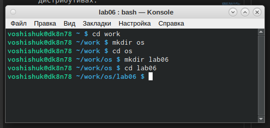{#fig:001 width=70%}

2). Переходим в созданный каталог с помощью команды cd  
3). Вызываем vi и создаем файл hello.sh(рис.2)

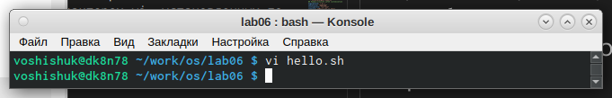{#fig:002 width=70%}

4). Ввели текст из инструкции, нажав перед этим клавишу "i" (рис.3)  

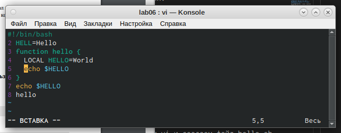{#fig:003 width=70%}

5). НАжали esc для перехода в командный режим.  
6).Нажали ":" для перехода в режим последней строки.  
7). Нажали w и q, а затем enter для записи, выхода и сохранения. (рис.4)

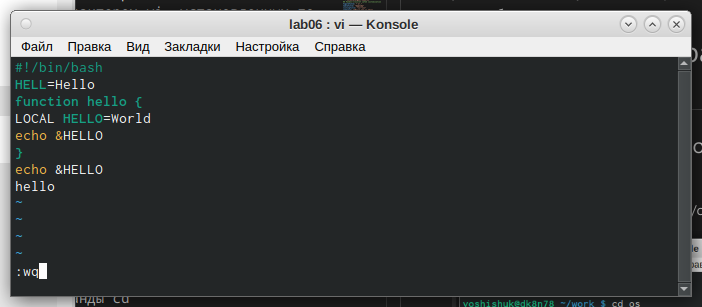{#fig:004 width=70%}

8). Сделали файл исполняемым(рис.5)

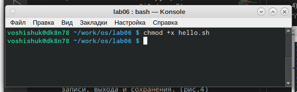{#fig:005 width=70%}

## Задание 2. Редактирование существующего файла.
1). Вызвали vi на редактирование файла.(рис.6)

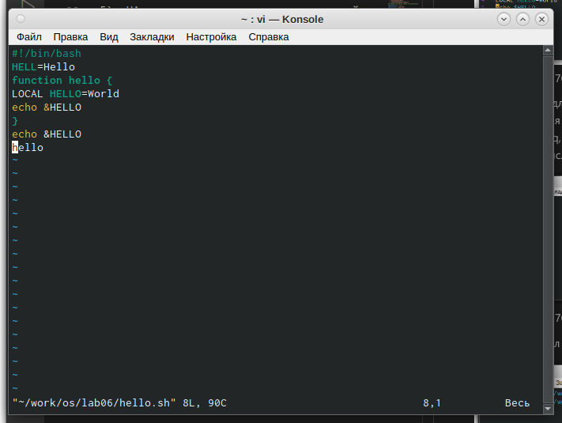{#fig:006 width=70%}

2). Установили курсор в конец слова HELL второй строки.  
3). Перешли в режим вставки и замените на HELLO.(рис.7)

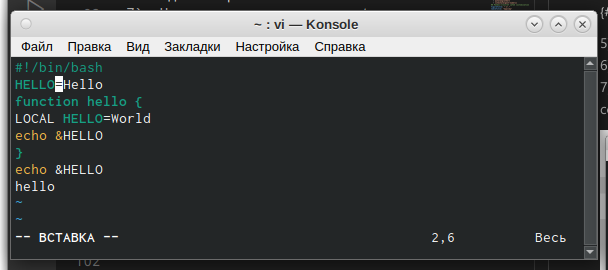{#fig:007 width=70%}

4). Установите курсор на четвертую строку и сотрите слово LOCAL.  
5). Перейдите в режим вставки и наберите следующий текст: local (рис.8)

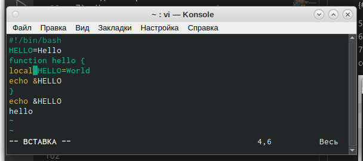{#fig:008 width=70%}

6). Установили курсор на последней строке файла. Вставили после неё строку, содержащую
следующий текст: echo $HELLO. (рис.9)

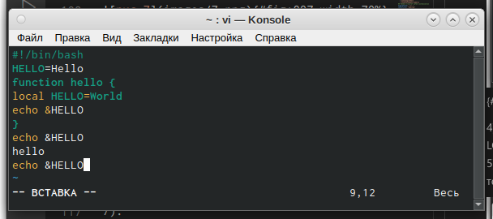{#fig:009 width=70%}

7). Нажали esc для перехода в командный режим.    
8). Удалили последнюю строку с помощью двойного нажатия клавиши "d".  
9). Ввели команду отмены изменений "u" и отменили последнюю команду.(рис.10)

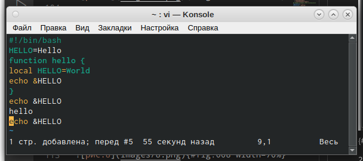{#fig:010 width=70%}

10). Ввели символ ":", сохранили файл и вышли из него(рис.11)

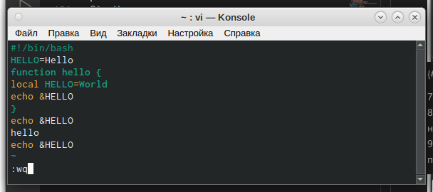{#fig:011 width=70%}

Контрольные вопросы:  
1. Редактор vi имеет три режима работы:
- командный режим − предназначен для ввода команд редактирования и
навигации по редактируемому файлу;
- режим вставки − предназначен для ввода содержания редактируемого файла;
- режим последней (или командной) строки - используется для записи изменений в файл и выхода из редактора.
2. Чтобы выйти из редактора, не сохраняя произведённые изменения, нужно
в режиме командной строки нажать клавиши «:» «q» «!»
3. Команды позиционирования:
- «0» (ноль) − переход в начало строки;
- «$» − переход в конец строки;
- «G» − переход в конец файла;
- n«G» − переход на строку с номером n.
4. При использовании прописных W и B под разделителями понимаются только пробел, табуляция и возврат каретки. При использовании строчных w и
b под разделителями понимаются также любые знаки пунктуации.
5.  Чтобы из любого места редактируемого файла перейти в начало (конец)
файла, нужно в режиме командной строки нажать клавиши «1» «G» («G»).
6. Команды редактирования: Вставка текста
- «а» − вставить текст после курсора;
- «А» − вставить текст в конец строки;
- «i» − вставить текст перед курсором;
- n «i» − вставить текст n раз;
- «I» − вставить текст в начало строки. Вставка строки
- «о» − вставить строку под курсором;
- «О» − вставить строку над курсором. Удаление текста
- «x» − удалить один символ в буфер;
- «d» «w» − удалить одно слово в буфер;
- «d» «$» − удалить в буфер текст от курсора до конца строки;
- «d» «0» − удалить в буфер текст от начала строки до позиции курсора;
- «d» «d» − удалить в буфер одну строку;
- n «d» «d» − удалить в буфер n строк. Отмена и повтор произведённых изменений
- «u» − отменить последнее изменение;
- «.» − повторить последнее изменение.Копирование текста в буфер
- «Y» − скопировать строку в буфер;
- n «Y» − скопировать n строк в буфер;
- «y» «w» − скопировать слово в буфер. Вставка текста из буфера
- «p» − вставить текст из буфера после курсора;
- «P» − вставить текст из буфера перед курсором. Замена текста
- «c» «w» − заменить слово;
- n «c» «w» − заменить n слов;
- «c» «$» − заменить текст от курсора до конца строки;
7. Чтобы заполнить строку символами , , 𝑛«𝐺», 𝑛–, «0».«𝑐»«», чтобы заменить текст от курсора до конца строки, и ввести символы $.
8. Чтобы отменить по одному предыдущему действию последовательно,необходимо нажать «u». Чтобы отменить все изменения, произведённые со
времени последней записи, нужно нажать «:» «e» «!».
9. Команды редактирования в режиме командной строки Копирование и перемещение текста
- «:» n,m «d» − удалить строки с n по m;
- «:» i,j «m» k − переместить строки с i по j, начиная со строки k;
- «:» i,j «t» k − копировать строки с i по j в строку k;
- «:» i,j «w» имя-файла − записать строки с i по j в файл с именем имя-файла.
Запись в файл и выход из редактора
- «:» «w» − записать изменённый текст в файл, не выходя из vi;
- «:» «w» имя-файла − записать изменённый текст в новый файл с именем
имя-файла;
- «:» «w» «!» имя-файла − записать изменённый текст в файл с именем имяфайла;
- «:» «w» «q» − записать изменения в файл и выйти из vi;
- «:» «q» − выйти из редактора vi;
- «:» «q» «!» − выйти из редактора без записи;
10. Чтобы определить, не перемещая курсора, позицию, в которой заканчивается строка, нужно в командном режиме находясь на нужной строке нажать
«$» и посмотреть на число после запятой в правом нижнем углу экрана.
11. Опции редактора vi позволяют настроить рабочую среду. Для задания опций используется команда set (в режиме командной строки). Если вы хотите
отказаться от использования опции, то в команде set перед именем опции
надо поставить no. Чтобы просмотреть опции редактора vi, необходимо нажать «:» set all. Нажав «:» help “название_опции”, можно узнать назначение
конкретной опции.
12. В режиме командной строки внизу редактора присутствует «:», в режиме
ввода – «– ВСТАВКА –», в командном режиме внизу ничего нет.
# Выводы
Я ознакомился с операционной системой Linux и получила практические навыки работы с редактором vi в ходе выполнения данной лабораторной работы.

