---
## Front matter
title: "Отчёт по лабораторной работе №9"
subtitle: "Дисциплина: Операционные Системы"
author: "Шишук Владислав Олегович, НПМбд-03-21"

## Generic otions
lang: ru-RU
toc-title: "Содержание"

## Bibliography
bibliography: bib/cite.bib
csl: pandoc/csl/gost-r-7-0-5-2008-numeric.csl

## Pdf output format
toc: true # Table of contents
toc-depth: 2
lof: true # List of figures
lot: true # List of tables
fontsize: 12pt
linestretch: 1.5
papersize: a4
documentclass: scrreprt
## I18n polyglossia
polyglossia-lang:
  name: russian
  options:
	- spelling=modern
	- babelshorthands=true
polyglossia-otherlangs:
  name: english
## I18n babel
babel-lang: russian
babel-otherlangs: english
## Fonts
mainfont: PT Serif
romanfont: PT Serif
sansfont: PT Sans
monofont: PT Mono
mainfontoptions: Ligatures=TeX
romanfontoptions: Ligatures=TeX
sansfontoptions: Ligatures=TeX,Scale=MatchLowercase
monofontoptions: Scale=MatchLowercase,Scale=0.9
## Biblatex
biblatex: true
biblio-style: "gost-numeric"
biblatexoptions:
  - parentracker=true
  - backend=biber
  - hyperref=auto
  - language=auto
  - autolang=other*
  - citestyle=gost-numeric
## Pandoc-crossref LaTeX customization
figureTitle: "Рис."
tableTitle: "Таблица"
listingTitle: "Листинг"
lofTitle: "Список иллюстраций"
lotTitle: "Список таблиц"
lolTitle: "Листинги"
## Misc options
indent: true
header-includes:
  - \usepackage{indentfirst}
  - \usepackage{float} # keep figures where there are in the text
  - \floatplacement{figure}{H} # keep figures where there are in the text
---

# Цель работы
Познакомиться с операционной системой Linux. Получить практические навыки работы с редактором Emacs.

# Выполнение лабораторной работы
1). Открываем emacs c помощью команды "emacs &"(рис.1)
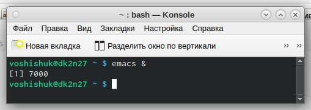{#fig:001 width=70%}

2). Создали файл lab07.sh с помощью комбинации "ctrl-x""ctrl-f"(рис.2)
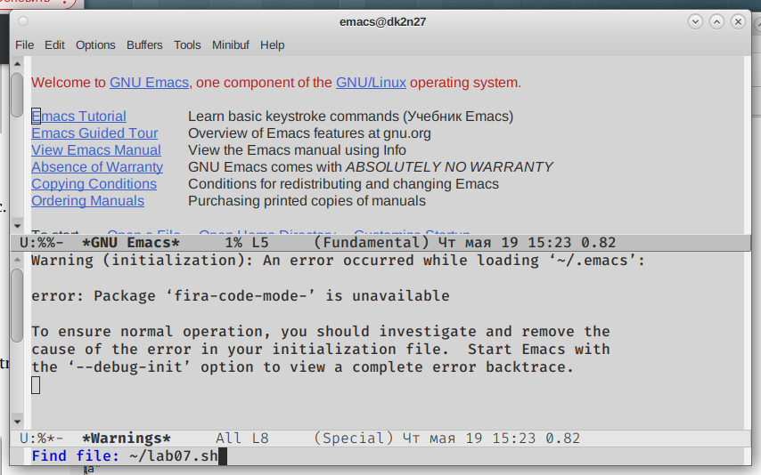{#fig:002 width=70%}

3). Набрали текст из задания.(рис.3)
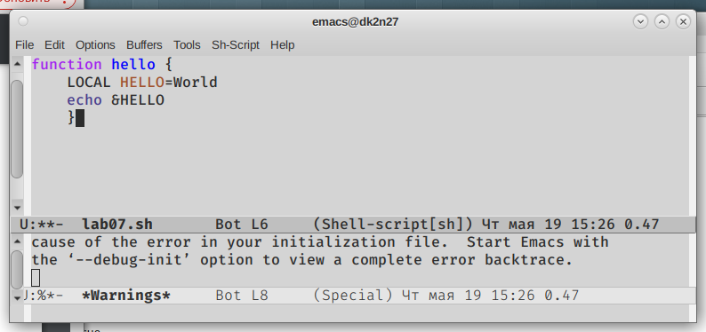{#fig:003 width=70%}

4). Сохранили файл lab07.sh с помощью комбинации "ctrl-x""ctrl-s"(рис.4)
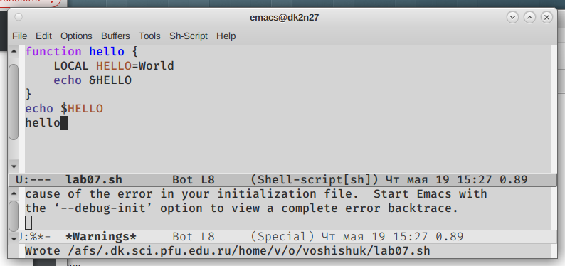{#fig:004 width=70%}

5). Выполнили стандартные процедуры редактирования текста:  
1.  Вырезали одной командой целую строку (С-k).(рис.5.1)
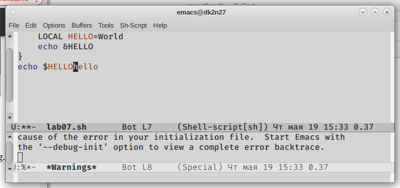{#fig:005 width=70%}

2. Вставили эту строку в конец файла (C-y).(рис.5.2)
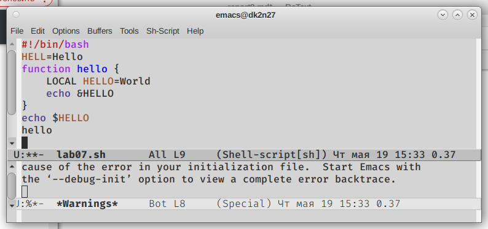{#fig:006 width=70%}

3. Выделили область текста (С-space) (рис.5.3)
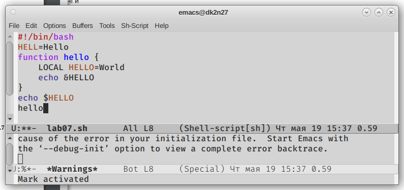{#fig:007 width=70%}

4. Скопировали область в буфер обмена (М -w)
5. Вставили область в конец файла (C-y) (рис.5.5)
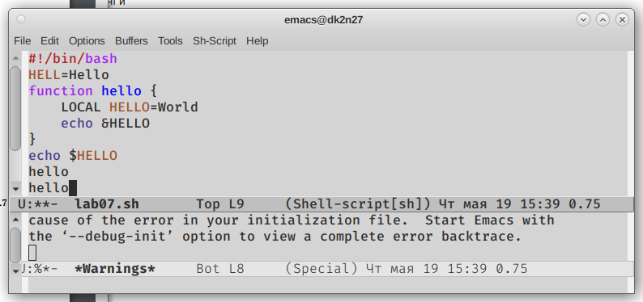{#fig:008 width=70%}

6. Вновь выделили область и вырезали её (С-w)(рис.5.6)
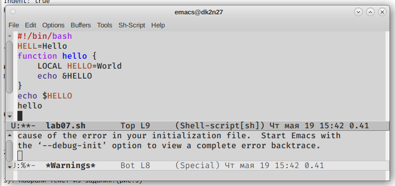{#fig:009 width=70%}

7. Отменили последнее действие (С-/)(рис.5.7)
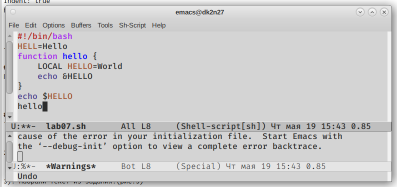{#fig:010 width=70%}

6). Научились пользоваться командами по перемещению курсора:  
1. Переместили курсор в начало строки (C-a). (рис.6.1)
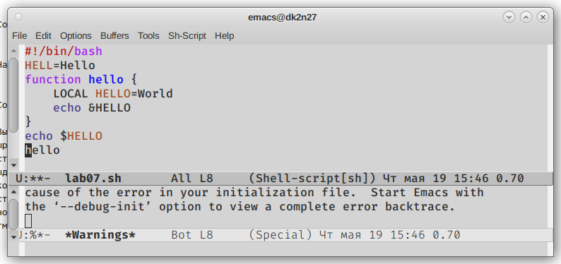{#fig:011 width=70%}
2. Переместили курсор в конец строки (C-e). (рис.6.2)
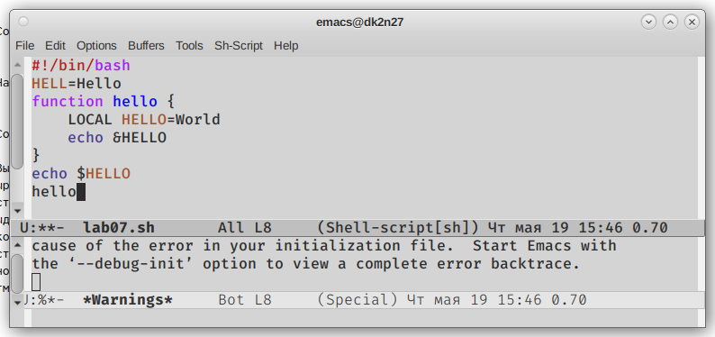{#fig:013 width=70%}
3. Переместили курсор в начало буфера (M-<). (рис.6.3)
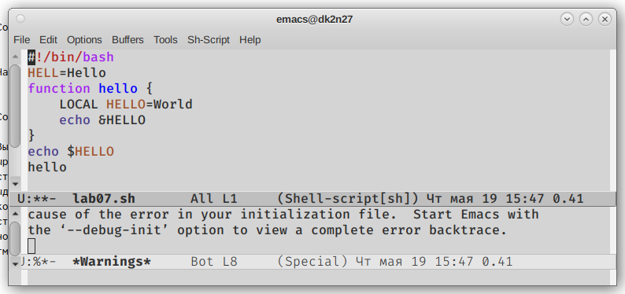{#fig:014 width=70%}
4. Переместили курсор в конец буфера (M->). (рис.6.4)
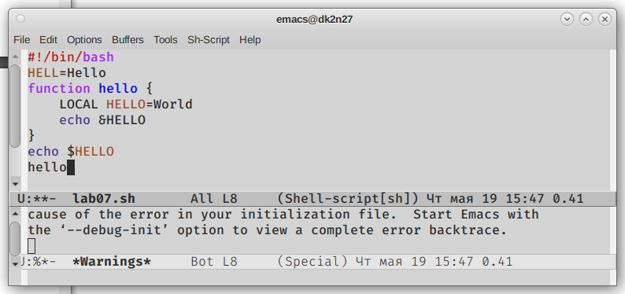{#fig:015 width=70%}

7). Управление буферами:  
1. Вывели список активных буферов на экран (C-x C-b).(рис.7.1)
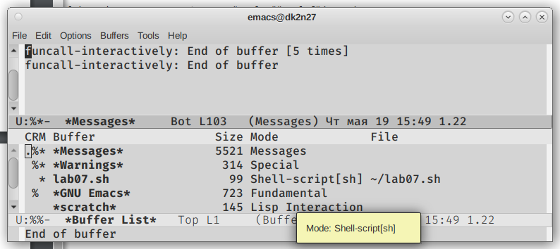{#fig:016 width=70%}
2. Переместили во вновь открытое окно (C-x) o со списком открытых буферов и переключили на другой буфер.(рис.7.2)
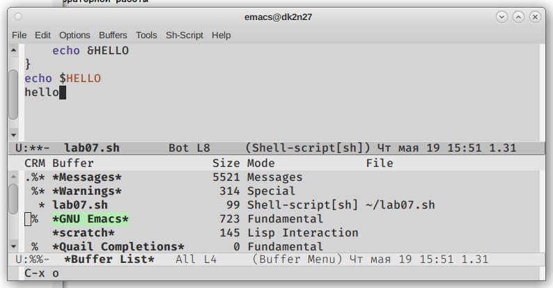{#fig:017 width=70%}
3. Закрыли это окно (C-x 0).(рис.7.3)
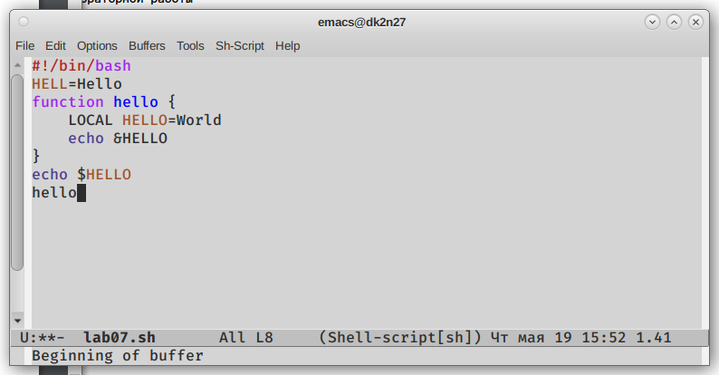{#fig:018 width=70%}
4. Теперь вновь переключились между буферами, но уже без вывода их списка на экран (C-x b).(рис.7.4)
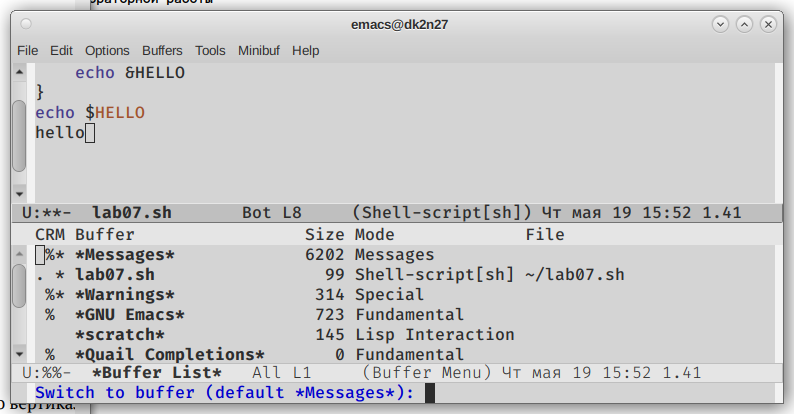{#fig:019 width=70%}
8). Управление окнами:  
1. Поделили фрейм на 4 части: разделите фрейм на два окна по вертикали (C-x 3), а затем каждое из этих окон на две части по горизонтали (C-x 2)(рис.8.1)
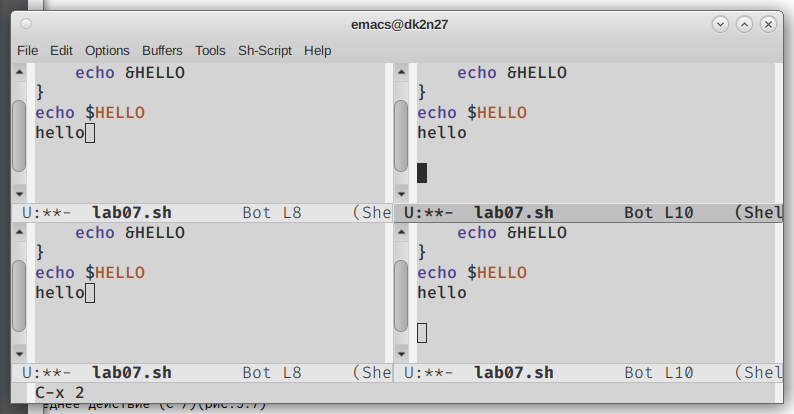{#fig:020 width=70%}
2. Создали 4 файла с помощью touch (рис.8.2.1) и открыли их в  1 из 4 буферов и ввели  пару строк текста (рис.8.2.2)
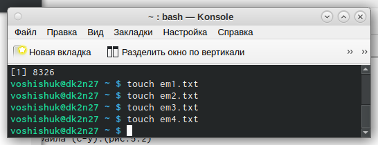{#fig:021 width=70%}
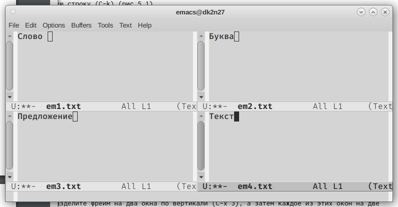{#fig:022 width=70%}
9). Режим поиска:  
1. Переключились в режим поиска (C-s) и найдите несколько слов, присутствующих
в тексте.(рис.9.1)
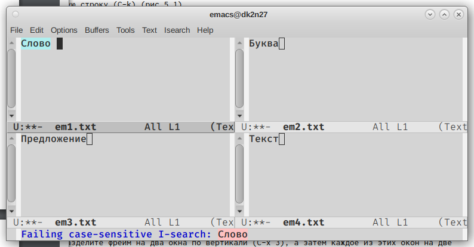{#fig:023 width=70%}
2. Переключайтесь между результатами поиска, нажимая C-s.(рис.9.2)
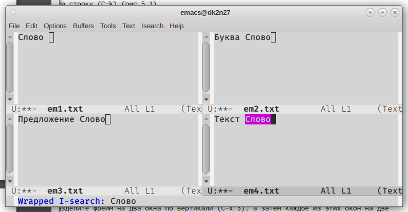{#fig:024 width=70%}
3. Выйдите из режима поиска, нажав C-g.
4. Перейдите в режим поиска и замены (M-%), введите текст, который следует найти
и заменить, нажмите Enter , затем введите текст для замены. После того как будут
подсвечены результаты поиска, нажмите ! для подтверждения замены.(рис.9.4)
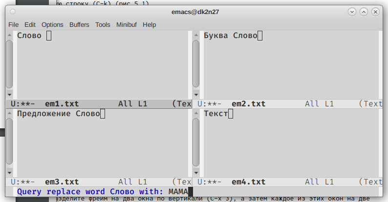{#fig:025 width=70%}
# Контрольные вопросы
1. Emacs − один из наиболее мощных и широко распространённых редакторов,
используемых в мире Unix. По популярности он соперничает с редактором
vi и его клонами.  
2. Основную трудность для новичков при освоении данного редактора могут
составлять большое количество команд, комбинаций клавиш, которые не
получится все запомнить с первого раза и поэтоу придется часто обращаться
к справочным материалам.  
3. Буфер – это объект, представляющий собой текст. Если имеется несколько
буферов, то редактировать можно только один. Обычно буфер считывает данные из файла или записывает в файл данные из буфера. Окно – это
область экрана, отображающая буфер. При запуске редактора отображается
одно окно, но при обращении к некоторым функциям могут открыться
дополнительные окна. Окна Emacs и окна графической среды X Window –
разные вещи. Одно окно X Window может быть разбито на несколько окон
в смысле Emacs, в каждом из которых отображается отдельный буфер.  
4. Да,можно.  
5. При запуске Emacs по умолчанию создаются следующие буферы:«scratch» (буфер для несохраненного текста), «Messages» (журнал ошибок, включающий также информацию, которая
появляется в области EchoArea), «GNU Emacs» (справочный буфер о редакторе).  
6.C-c | сначала, удерживая «ctrl», нажимаю «c», после – отпускаю обе клавиши и нажимаю «|» C-c C-| сначала, удерживая «ctrl», нажимаю «с», после –
отпускаю обе клавиши и, удерживая «ctrl», нажимаю «|»  
7. Чтобы поделить окно на две части необходимо воспользоваться комбинацией «Ctrl-x 3» (по вертикали) или «Ctrl-x 2» (по горизонтали)  
8. Настройки Emacs хранятся в файле .emacs.
9. -  
10. Более удобным я считаю редактор emacs, потому что в нем проще открывать
другие файлы, можно использовать сразу несколько окон, нет «Командного
режима», «Режима ввода», «Режима командной строки», которые являются
немного непривычными и в какой-то степени неудобными.  
# Выводы
За время выполнения данной лабораторной работы я получил навыки работы с редактором Emacs. Также я лучше узнал операционную систему  Linux.
