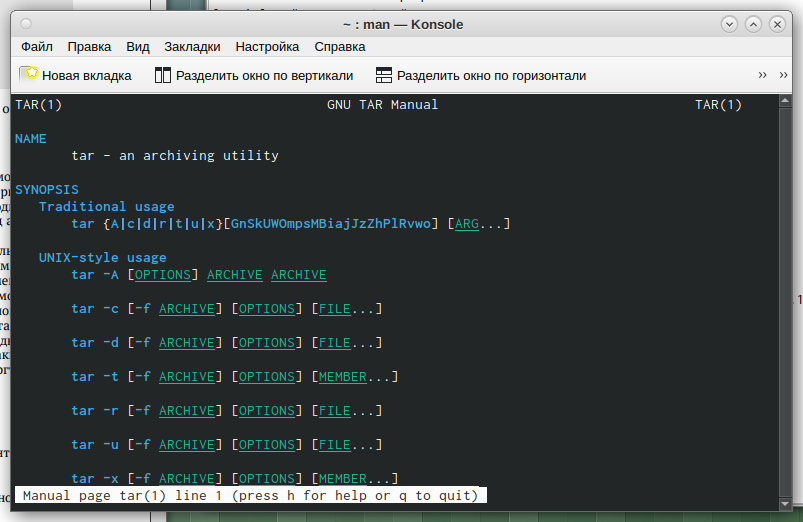
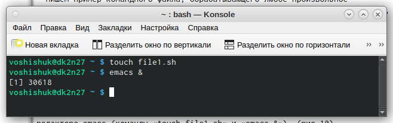
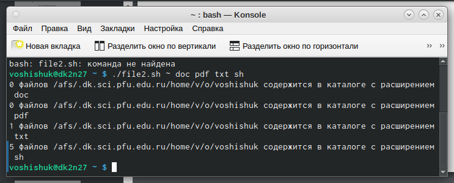

---
## Front matter
title: "Отчёт по лабораторной работе №10"
subtitle: "Дисциплина: Операционные Системы"
author: "Шишук Владислав Олегович, НПМбд-03-21"

## Generic otions
lang: ru-RU
toc-title: "Содержание"

## Bibliography
bibliography: bib/cite.bib
csl: pandoc/csl/gost-r-7-0-5-2008-numeric.csl

## Pdf output format
toc: true # Table of contents
toc-depth: 2
lof: true # List of figures
lot: true # List of tables
fontsize: 12pt
linestretch: 1.5
papersize: a4
documentclass: scrreprt
## I18n polyglossia
polyglossia-lang:
  name: russian
  options:
	- spelling=modern
	- babelshorthands=true
polyglossia-otherlangs:
  name: english
## I18n babel
babel-lang: russian
babel-otherlangs: english
## Fonts
mainfont: PT Serif
romanfont: PT Serif
sansfont: PT Sans
monofont: PT Mono
mainfontoptions: Ligatures=TeX
romanfontoptions: Ligatures=TeX
sansfontoptions: Ligatures=TeX,Scale=MatchLowercase
monofontoptions: Scale=MatchLowercase,Scale=0.9
## Biblatex
biblatex: true
biblio-style: "gost-numeric"
biblatexoptions:
  - parentracker=true
  - backend=biber
  - hyperref=auto
  - language=auto
  - autolang=other*
  - citestyle=gost-numeric
## Pandoc-crossref LaTeX customization
figureTitle: "Рис."
tableTitle: "Таблица"
listingTitle: "Листинг"
lofTitle: "Список иллюстраций"
lotTitle: "Список таблиц"
lolTitle: "Листинги"
## Misc options
indent: true
header-includes:
  - \usepackage{indentfirst}
  - \usepackage{float} # keep figures where there are in the text
  - \floatplacement{figure}{H} # keep figures where there are in the text
---

# Цель работы
Изучить основы программирования в оболочке ОС UNIX/Linux. Научиться писать
небольшие командные файлы.

# Выполнение лабораторной работы
1). Изучаем команды архивации zip, bzip2, tar, используя команду man (рис.1-3)
{#fig:001 width=70%}
{#fig:002 width=70%}
{#fig:003 width=70%}

- создаем файл, в котором будем писать первый скрипт, и открываем его в
редакторе emacs (команды «touch backup.sh» и «emacs &»)(рис.4)
{#fig:004 width=70%}

- Пишем скрипт, который при запуске будет делать резервную копию самого
себя (то есть файла, в котором содержится его исходный код) в другую директорию backup в нашем домашнем каталоге. При этом файл должен архивироваться
одним из архиваторов на выбор zip, bzip2 или tar. При написании скрипта используем архиватор bzip2. (рис.5)
{#fig:005 width=70%}

- Проверяем работу скрипта (команда «./backup.sh»), перед этим добавив для
него право на выполнение (команда «chmod +x *.sh»). Проверяем, появился ли каталог backup/, перейдя в него (команда «cd backup/»), просмотриваем содержимое архива (команда «bunzip2 -c backup.sh.bz2»). Скрипт работает корректно.(рис.6)
{#fig:006 width=70%}

2).

- Создаем файл, в котором буду писать второй скрипт, и открываем его в
редакторе emacs (команды «touch file.sh» и «emacs &»). (рис.7)
{#fig:007 width=70%}

- Пишем пример командного файла, обрабатывающего любое произвольное
число аргументов командной строки, в том числе превышающее десять. Например, скрипт может последовательно распечатывать значения всех переданных
аргументов. (рис.8)
{#fig:008 width=70%}

- Проверил работу написанного скрипта (рис.9)
{#fig:009 width=70%}

3).

- Создаем файл, в котором буду писать третий скрипт, и открываем его в
редакторе emacs (команды «touch file1.sh» и «emacs &»). (рис.10)
{#fig:010 width=70%}

- Пишем командный файл − аналог команды ls (без использования самой этой
команды и команды dir). Он должен выдавать информациюо нужном каталоге и
выводить информацию о возможностях доступа к файлам этого каталога (рис.11)
{#fig:011 width=70%}
- Далее проверяем работу скрипта (команда «./file1.sh ~»), предварительно добавив для него право на выполнение (команда «chmod +x *.sh»). Скрипт работает
корректно. (рис.12)
{#fig:012 width=70%}
4).

- Создаем файл, в котором буду писать третий скрипт, и открываем его в
редакторе emacs (команды «touch file2.sh» и «emacs &»).(рис.13)
{#fig:013 width=70%}
- Пишем командный файл, который получает в качестве аргумента командной
строки формат файла (.txt, .doc, .jpg, .pdf и т.д.) и вычисляет количество таких
файлов в указанной директории. Путь к директории также передаётся в виде
аргумента командной строки.(рис.14)
{#fig:014 width=70%}
- Проверяем работу написанного скрипта (команда «./file.sh ~ doc pdf txt sh »),
предварительно добавив для него право на выполнение (команда «chmod +x
*.sh»). Скрипт работает корректно. (рис.15)
{#fig:015 width=70%}

# Контрольные вопросы

1. Командный процессор (командная оболочка, интерпретатор команд shell) − это программа, позволяющая пользователю взаимодействовать с операционной системой компьютера.
2. POSIX (Portable Operating System Interface for Computer Environments) − набор стандартов описания интерфейсов взаимодействия операционной системы и прикладных программ. Стандарты POSIX разработаны комитетом IEEE (Institute of Electrical and Electronics Engineers) для обеспечения совместимости различных UNIX/Linux подобных операционных систем и переносимости прикладных программ на уровне исходного кода. POSIXсовместимые оболочки разработаны на базе оболочки Корна.
3. Командный процессор bash обеспечивает возможность использования переменных типа строка символов. Имена переменных могут быть выбраны пользователем. Пользователь имеет возможность присвоить переменной значение некоторой строки символов. Например, команда«mark=/usr/andy/bin» присваивает значение строки символов /usr/andy/bin переменной mark типа строка символов. Значение, присвоенное некоторой переменной, может быть впоследствии использовано. Для этого в соответствующем месте командной строки должно быть употреблено имя этой переменной, которому предшествует метасимвол $. Например, команда «mv afile ${mark}» переместит файл afile из текущего каталога в каталог с абсолютным полным именем /usr/andy/bin. Оболочка bash позволяет работать с массивами. Для создания массива используется команда set с флагом -A. За флагом следует имя переменной, а затем список значений, разделённых пробелами. Например, «set -A states Delaw -are Michigan “New Jersey”» Далее можно сделать добавление в массив, например, states[49]=Alaska. Индексация массивов начинается с нулевого элемента.
4. Оболочка bash поддерживает встроенные арифметические функции. Команда let является показателем того, что последующие аргументы представляют собой выражение, подлежащее вычислению. Простейшее выражение − это единичный терм (term), обычно целочисленный. Команда let берет два операнда и присваивает их переменной. Команда read позволяет читать значения переменных со стандартного ввода: «echo “Please enter Month and Day of Birth ?”» «read mon day trash» В переменные mon и day будут считаны соответствующие значения, введённые с клавиатуры, а переменная trash нужна для того, чтобы отобрать всю избыточно введённую информаци
5. В языке программирования bash можно применять такие арифметические операции как сложение (+), вычитание (-), умножение(*), целочисленное деление (/) и целочисленный остаток от деления (%).
6. В (( )) можно записывать условия оболочки bash, а также внутри двойных скобок можно вычислять арифметические выражения и возвращать результат.ю и игнорировать её.
7. -
8. Такие символы, как ’ < > * ? | ” &, являются метасимволами и имеют длякомандного процессора специальный смысл
9. Снятие специального смысла с метасимвола экранированием метасимвола. Экранирование может быть осуществлено с помощью предшествующего метасимволу символа , который, в свою очередь, является метасимволом. Для экранирования группы метасимволов нужно заключить её в одинарные кавычки. Строка, заключённая в двойные кавычки, экранирует все метасимволы, кроме $, ’ , , ”. Например, – echo * выведет на экран символ , – echo ab’|’cd выведет на экран строку ab|*cd.
10. Последовательность команд может быть помещена в текстовый файл. Такой файл называется командным. Далее этот файл можно выполнить по команде: «bash командный_файл [аргументы]» Чтобы не вводить каждый раз последовательности символов bash, необходимо изменить код защиты этого командного файла, обеспечив доступ к этому файлу по выполнению. Это может быть сделано с помощью команды «chmod +x имя_файла» Теперь можно вызывать свой командный файл на выполнение, просто вводя его имя с терминала так, как будто он является выполняемой программой. Командный процессор распознает, что в Вашем файле на самом деле хранится не выполняемая программа, а программа, написанная на языке программирования оболочки, и осуществит еёинтерпретацию.
11. Группу команд можно объединить в функцию. Для этого существует ключевое слово function, после которого следует имя функции и список команд, заключённых в фигурные скобки. Удалить функцию можно с помощью команды unset c флагом -f.
12. Чтобы выяснить, является ли файл каталогом или обычным файлом, необходимо воспользоваться командами «test -f [путь до файла]» (для проверки, является ли обычным файлом) и «test -d [путь до файла]» (для проверки, является ли каталогом).
13. Команду «set» можно использовать для вывода списка переменных окружения. В системах Ubuntu и Debian команда «set» также выведет список функций командной оболочки после списка переменных командной оболочки. Поэтому для ознакомления со всеми элементами списка переменных окружения при работе с данными системами рекомендуется использовать команду «set | more». Команда «typeset» предназначена для наложения ограничений на переменные. Команду «unset» следует использовать для удаления переменной из окружения командной оболочки.
14. При вызове командного файла на выполнение параметры ему могут быть переданы точно таким же образом, как и выполняемой программе. С точки зрения командного позиционными. Символ $ файла является эти параметры метасимволом являются командного процессора. Он используется, в частности, для ссылки на параметры, точнее, для получения их значений в командном файле. В командный файл можно передать до девяти параметров. При использовании где-либо в командном файле комбинации символов $i, где 0 < i < 10, вместо неё будет осуществлена подстановка значения параметра с порядковым номером i, т. е. аргумента командного файла с порядковым номером i. Использование комбинации символов $0 приводит к подстановкевместо неё имени данного командного файла.

# Выводы
Я изучил основы программирования в оболочке ОС UNIX/Linux и научился
писать небольшие командные файлы.
