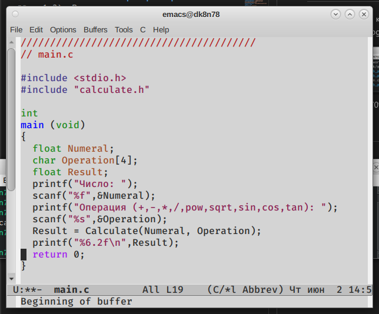

---
## Front matter
lang: ru-RU
title: Лабораторная работа №13
author: Шишук Владислав Олегович
institute: \inst{1}RUDN University, Moscow, Russian Federation

## Formatting
toc: false
slide_level: 2
theme: metropolis
header-includes:
aspectratio: 43
section-titles: true
---

# Выполнение работы 

 - создал подкаталог ~/work/os/lab_prog, а там - файлы calculate.h, calculate.c, main.c.(рис.1)
 
{ #fig:001 width=70% }

# Реализация примитивного калькулятора

 - Реализовал функции калькулятора в calculate.c (рис.2)

{ #fig:002 width=70% }

# Реализация примитивного калькулятора

 - Реализовал функции калькулятора в calculate.h (рис.3)
 
{ #fig:003 width=70% }

# Реализация примитивного калькулятора
 
 - Реализовал функции калькулятора в main.c (рис.4)
 
{ #fig:004 width=70% }

# Проверка и Отладка
 - запустил программу в отладчике и проверил работу (рис.5)

{ #fig:005 width=70% }

# Выводы
 Я приобрел простейшие навыки разработки, анализа, тестирования и отладки приложений в ОС типа UNIX/Linux на примере создания калькулятора с простейшими функциями.
