---
# Front matter
lang: ru-RU
title: "Отчет по лабораторной работе №13"
subtitle: "Дисциплина: Операционные системы"
author: "Шишук Владислав Олегович"

# Formatting
toc-title: "Содержание"
toc: true # Table of contents
toc_depth: 2
lof: true # List of figures
fontsize: 12pt
linestretch: 1.5
papersize: a4paper
documentclass: scrreprt
polyglossia-lang: russian
polyglossia-otherlangs: english
mainfont: PT Serif
romanfont: PT Serif
sansfont: PT Sans
monofont: PT Mono
mainfontoptions: Ligatures=TeX
romanfontoptions: Ligatures=TeX
sansfontoptions: Ligatures=TeX,Scale=MatchLowercase
monofontoptions: Scale=MatchLowercase
indent: true
pdf-engine: lualatex
header-includes:
  - \linepenalty=10 # the penalty added to the badness of each line within a paragraph (no associated penalty node) Increasing the value makes tex try to have fewer lines in the paragraph.
  - \interlinepenalty=0 # value of the penalty (node) added after each line of a paragraph.
  - \hyphenpenalty=50 # the penalty for line breaking at an automatically inserted hyphen
  - \exhyphenpenalty=50 # the penalty for line breaking at an explicit hyphen
  - \binoppenalty=700 # the penalty for breaking a line at a binary operator
  - \relpenalty=500 # the penalty for breaking a line at a relation
  - \clubpenalty=150 # extra penalty for breaking after first line of a paragraph
  - \widowpenalty=150 # extra penalty for breaking before last line of a paragraph
  - \displaywidowpenalty=50 # extra penalty for breaking before last line before a display math
  - \brokenpenalty=100 # extra penalty for page breaking after a hyphenated line
  - \predisplaypenalty=10000 # penalty for breaking before a display
  - \postdisplaypenalty=0 # penalty for breaking after a display
  - \floatingpenalty = 20000 # penalty for splitting an insertion (can only be split footnote in standard LaTeX)
  - \raggedbottom # or \flushbottom
  - \usepackage{float} # keep figures where there are in the text
  - \floatplacement{figure}{H} # keep figures where there are in the text
---

# Цель работы
Приобрести простейшие навыки разработки, анализа, тестирования и отладки приложений в ОС типа UNIX/Linux на примере создания на языке программирования
С калькулятора с простейшими функциями.
 

# Выполнение лабораторной работы
1. В домашнем каталоге создаем подкаталог ~/work/os/lab_prog (рис.1)

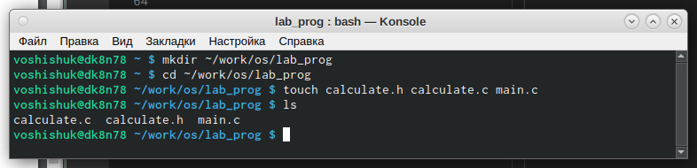{ #fig:001 width=70% }

2. Создаем в нем файлы  calculate.h, calculate.c, main.c.(рис.1) Далее реализуем функции калькулятора в файлах: calculate.c(рис.2,рис.3),calculate.h(рис.4),main.c(рис.5) 

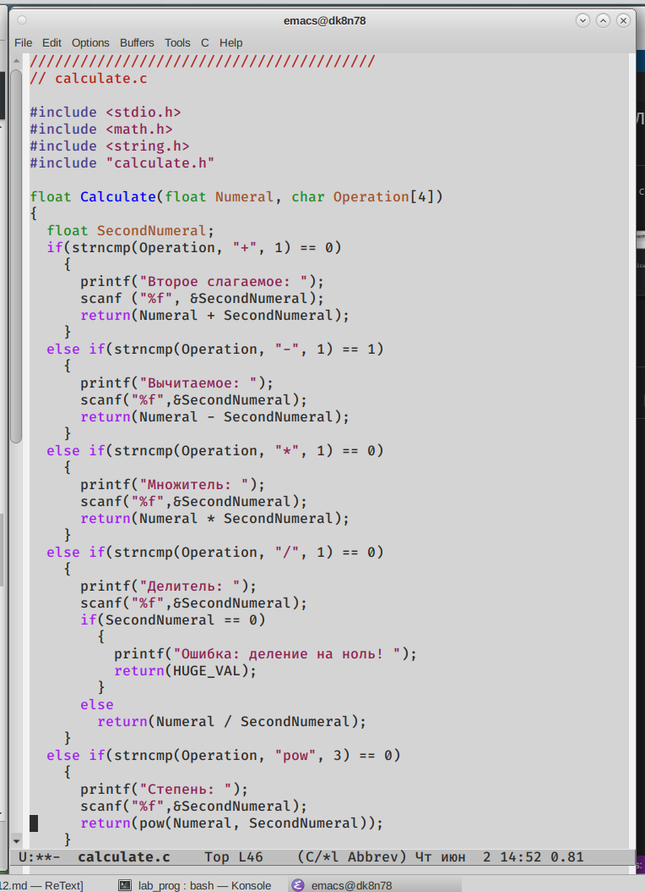{ #fig:002 width=70% }

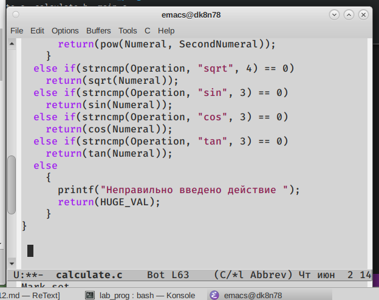{ #fig:003 width=70% }

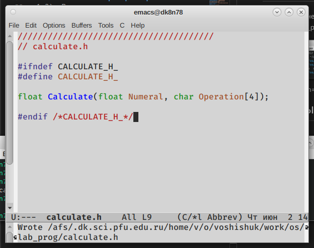{ #fig:004 width=70% }

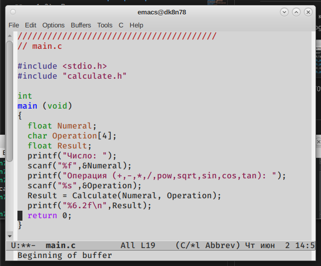{ #fig:005 width=70% }

3. Выполнили компиляцию посредством gcc(рис.6):

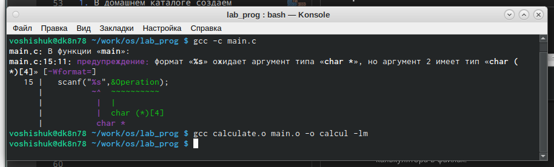{ #fig:006 width=70% }

4. Ошибок не возникло.
5. Создаем Makefile с нужным содержанием. Данный файл необходим для автоматической компиляции файлов calculate.c (цель calculate.o), main.c (цель main.o), а также их объединения в один исполняемый файл calcul (цель calcul). Цель clean нужна для автоматического удаления файлов. Переменная CC отвечает за утилиту для компиляции. Переменная CFLAGS отвечает за опции в данной утилите. Переменная LIBS отвечает за опции для объединения объектных файлов в один исполняемый файл. (рис.7)

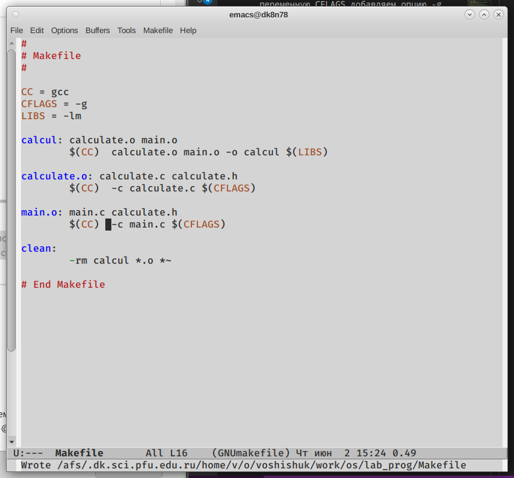{ #fig:007 width=70% }

6. Makefile уже исправлен: в переменную CFLAGS добавляем опцию -g, необходимую для компиляции объектных файлов и их использования в программе отладчика GDB; lелаем так, что утилита компиляции выбирается с помощью переменной CC.  
Выполняем компиляцию файлов, используя команды «make calculate.o», «make main.o», «male calcul».(рис.8)

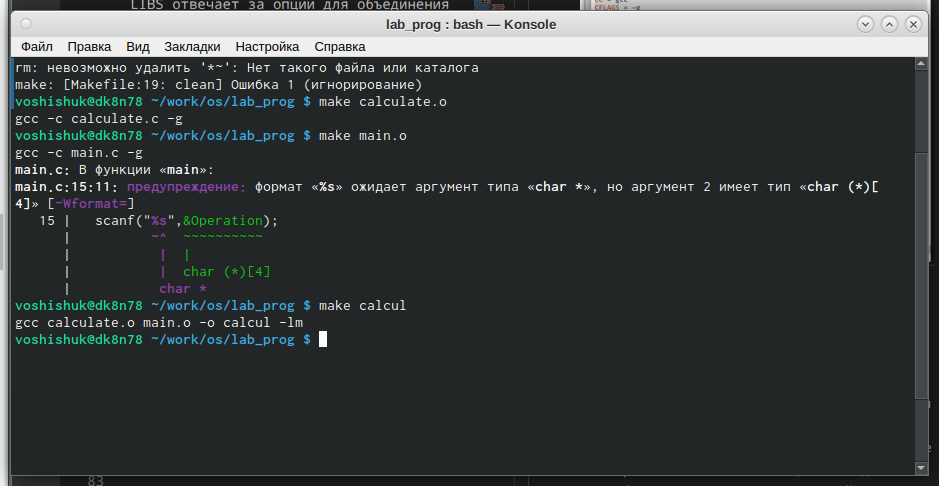{ #fig:008 width=70% }

- Запустили отладчик GDB, загрузив в него программу для отладки
- Для запуска программы внутри отладчика ввели команду run(рис.9)

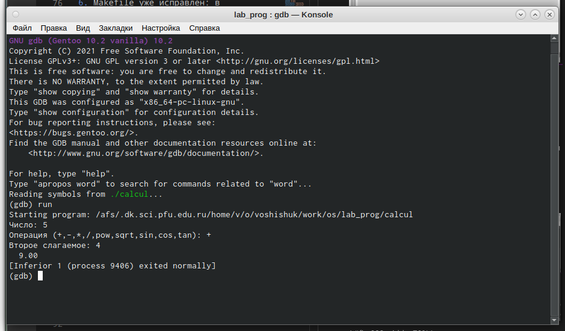{ #fig:009 width=70% }
- Для постраничного (по 9 строк) просмотра исходного код использовали команду
list
- Для просмотра строк с 12 по 15 основного файла использовали list с параметрами(рис.10)

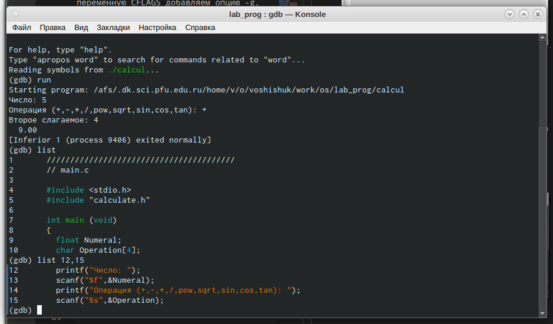{ #fig:010 width=70% }

- Для просмотра определённых строк не основного файла использовали list с параметрами
- Установили точку останова в файле calculate.c на строке номер 21(рис.11)

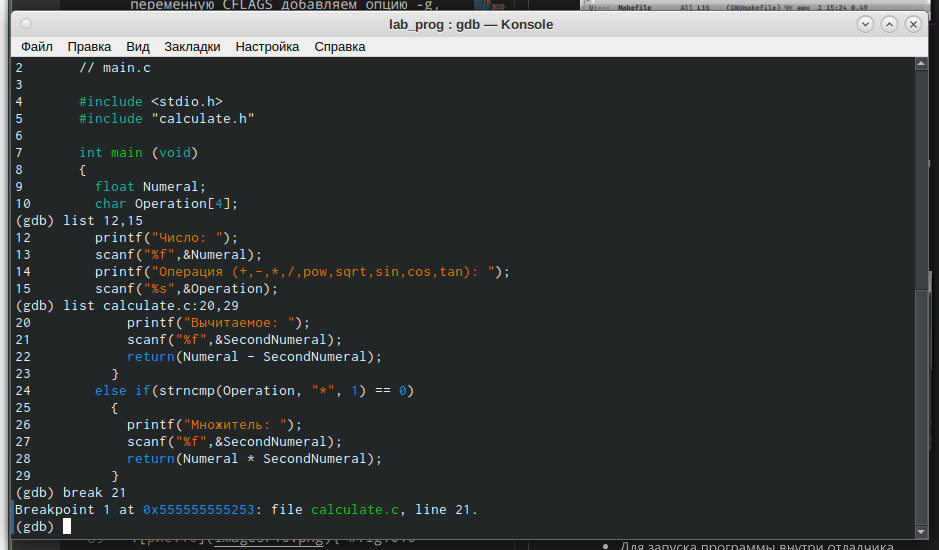{ #fig:011 width=70% }

- Вывели информацию об имеющихся в проекте точка останова
- Запустили программу внутри отладчика и убедились, что программа остановится
в момент прохождения точки останова:

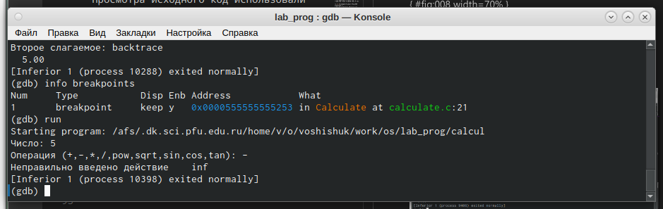{ #fig:012 width=70% }

- Убрали точку останова(рис.13)

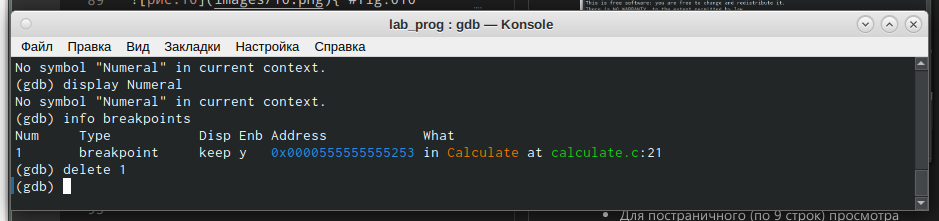{ #fig:013 width=70% }

7. С помощью утилиты splint анализируем коды файлов calculate.c и main.c. Предварительно устанавливаем данную утилиту с помощью команды «yum install splint». Далее используем команду «splint calculate.c» и «splint main.c». C помощью утилиты splint выяснилось, что в файлах calculate.c и main.c присутствует функция чтения scanf, возвращающая целое число (тип int), но эти числа не используются и нигде не сохранятся. Утилита вывела предупреждение о том, что в файле calculate.c происходит сравнение вещественного числа с нулем. Также возвращаемые значения (тип double) в функциях pow, sqrt, sin, cos и tan записываются в переменную типа float, что свидетельствует о потери данных.(рис.14-15)

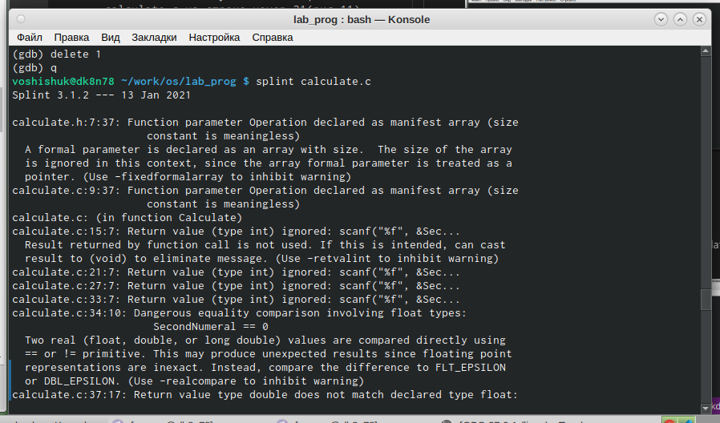{ #fig:014 width=70% }

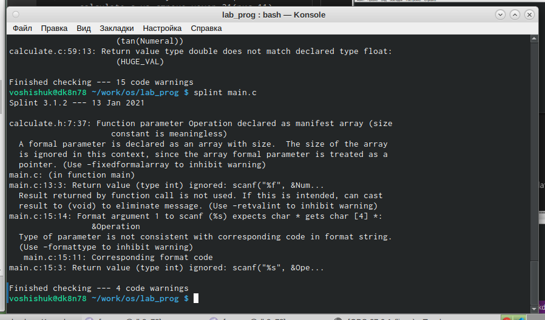{ #fig:015 width=70% }

# Выводы
Я приобрел простейшие навыки разработки, анализа, тестирования и отладки приложений в ОС типа UNIX/Linux на примере создания калькулятора с простейшими функциями.
 
# Контрольные вопросы
1. Чтобы получить информацию о возможностях программ gcc, make, gdb и др. нужно воспользоваться командой man или опцией -help (-h) для каждой команды.

2. Процесс разработки программного обеспечения обычно разделяется на следующие этапы:

- планирование, включающее сбор и анализ требований кфункционалу и другим характеристикам разрабатываемого приложения;
- проектирование, включающее в себя разработку базовых алгоритмов и спецификаций, определение языка программирования;
- непосредственная разработка приложения: o кодирование − по сути создание исходного текста программы (возможно в нескольких вариантах); – анализ разработанного кода; o сборка, компиляция и разработка исполняемого модуля; o тестирование и отладка, сохранение произведённых изменений;
- документирование. Для создания исходного текста программы разработчик может воспользоваться любым удобным для него редактором текста: vi, vim, mceditor, emacs, geany и др. После завершения написания исходного кода программы (возможно состоящей из нескольких файлов), необходимо её скомпилировать и получить исполняемый модуль.
3. Для имени входного файла суффикс определяет какая компиляция требуется. Суффиксы указывают на тип объекта. Файлы с расширением (суффиксом) .c воспринимаются gcc как программы на языке С, файлы с расширением .cc или .C − как файлы на языке C++, а файлы c расширением .o считаются объектными. Например, в команде «gcc -c main.c»: gcc по расширению (суффиксу) .c распознает тип файла для компиляции и формирует объектный модуль − файл с расширением .o. Если требуется получить исполняемый файл с определённым именем (например, hello), то требуется воспользоваться опцией -o и в качестве параметра задать имя создаваемого файла: «gcc -o hello main.c».

4. Основное назначение компилятора языка Си в UNIX заключается вкомпиляции всей программы и получении исполняемого файла/модуля.

5. Для сборки разрабатываемого приложения и собственно компиляции полезно воспользоваться утилитой make. Она позволяет автоматизировать процесс преобразования файлов программы из одной формы в другую, отслеживает взаимосвязи между файлами.

6. Для работы с утилитой make необходимо в корне рабочего каталога с Вашим проектом создать файл с названием makefile или Makefile, в котором будут описаны правила обработки файлов Вашего программного комплекса. В самом простом случае Makefile имеет следующий синтаксис: <цель_1> <цель_2> ... : <зависимость_1> <зависимость_2> ... <команда 1> ... <команда n> Сначала задаётся список целей, разделённых пробелами, за которым идёт двоеточие и список зависимостей. Затем в следующих строках указываются команды. Строки с командами обязательно должны начинаться с табуляции. В качестве цели в Makefile может выступать имя файла или название какого-то действия. Зависимость задаёт исходные параметры (условия) для достижения указанной цели. Зависимость также может быть названием какого-то действия. Команды − собственно действия, которые необходимо выполнить для достижения цели. Общий синтаксис Makefile имеет вид: target1 [target2...]:[:] [dependment1...] [(tab)commands] [#commentary] [(tab)commands] [#commentary] Здесь знак # определяет начало комментария (содержимое от знака # и до конца строки не будет обрабатываться. Одинарное двоеточие указывает на то, что последовательность команд должна содержаться водной строке. Для переноса можно в длинной строке команд можно использовать обратный слэш (). Двойное двоеточие указывает на то, что последовательность команд может содержаться в нескольких последовательных строках. Пример более сложного синтаксиса Makefile:

