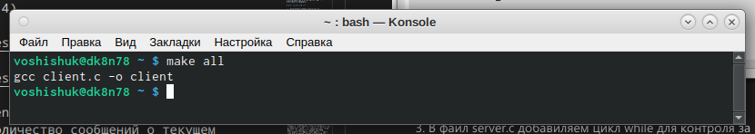

---
## Front matter
lang: ru-RU
title: Лабораторная работа №14
author: Шишук Владислав Олегович
institute: \inst{1}RUDN University, Moscow, Russian Federation

## Formatting
toc: false
slide_level: 2
theme: metropolis
header-includes:
aspectratio: 43
section-titles: true
---

# Выполнение работы 

 - Отредактировал программы из лабораторной работы(рис.1-4)
# Выполнение работы 

{ #fig:001 width=70% }

# Выполнение работы 

{ #fig:002 width=70% }

{ #fig:003 width=70% }

# Выполнение работы 

{ #fig:004 width=70% }

# Компиляция файлов

 - Скомпилировал файлы 

{ #fig:005 width=70% }

# Проверка работы написанного кода

 - запустил в первом терминале − «./server», в остальных двух – «./client». Спустя 30 секунд работа сервера была прекращена.
 
{ #fig:003 width=70% }

# Выводы
 Я приобрел практические навыки работы с именованными каналами.

